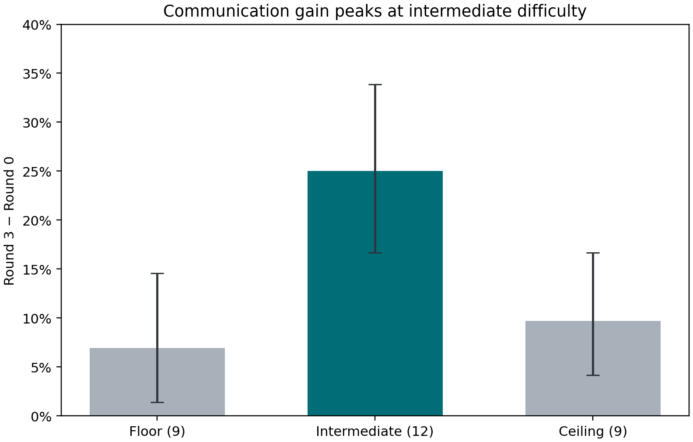
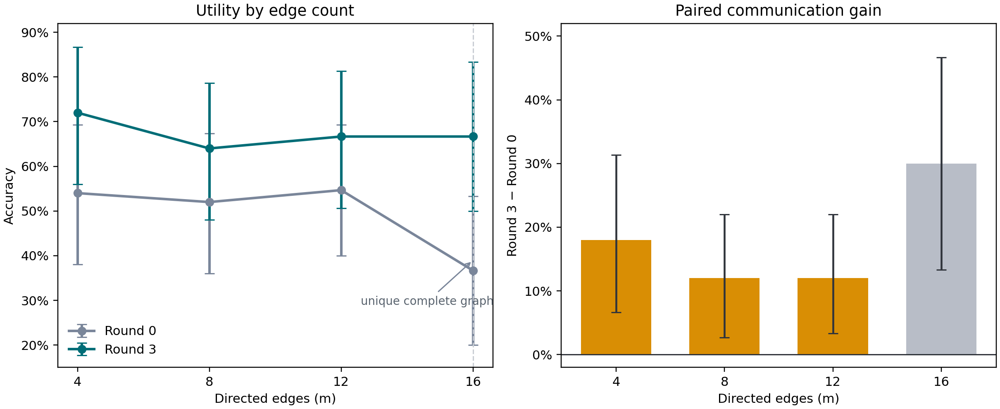
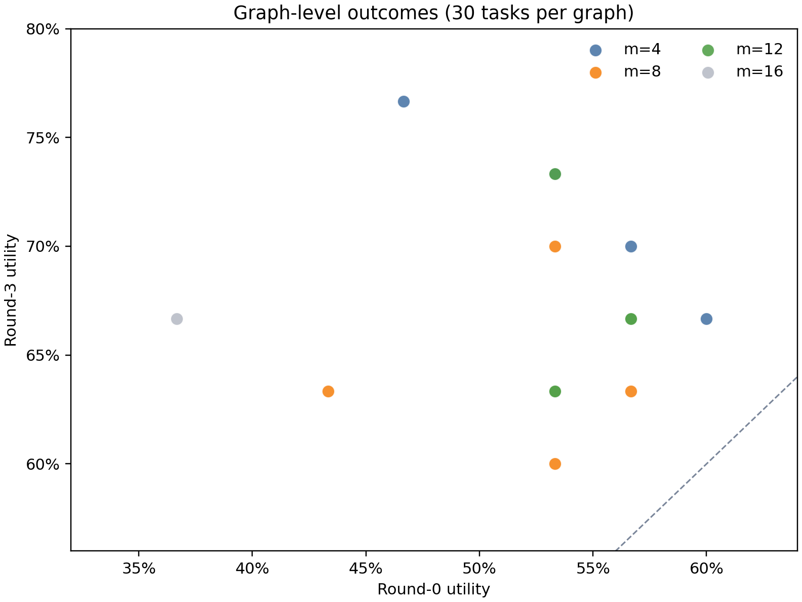

# 2026 AIME Qwen full-rationale clean-MAS results

## Scope and protocol validity

- Model: `Qwen/Qwen3-4B-Instruct-2507`.
- Sampling: `temperature=0.7`, `top_p=0.8`, `top_k=20`.
- Tasks: all 30 original 2026 AIME I/II problems.
- System: homogeneous `n=5`, readout node 4, `H=3`.
- Graphs: five rooted-nonisomorphic graphs for each of `m=4,8,12`, plus the
  unique complete graph at `m=16`.
- Runs: 16 graphs x 30 tasks = 480 independently generated clean runs.
- Prompt version: `homogeneous-aime-full-rationale-v1`.

The protocol audit passed all 480 runs, 6,810 normal node updates, and 4,890
broadcast messages. Every update made one physical model call. A node's complete
raw output was broadcast byte-for-byte to its out-neighbors. There was no
summarization, message compression, context overflow, context truncation, or
cross-run generation reuse.

Some generations did exhaust the independent 16,384-token output budget:
210/6,810 turns (3.08%). A total of 397/6,810 turns (5.83%) had no parseable
final answer. These are retained as model/format failures rather than deleted.
They are concentrated on the externally defined floor tasks, where the length
and unparsed-turn rates are 8.37% and 14.44%, respectively. This does not violate
full-rationale communication: the exact completion produced by the model,
including a length-terminated completion, is stored and broadcast without
post-processing.

## Primary clean-utility result

Across all 480 task-graph runs:

| Metric | Result |
|---|---:|
| Paired Round-0 readout utility | 52.5% |
| Round-3 readout utility | 67.5% |
| Paired communication gain | **+15.0 pp** |
| Task-bootstrap 95% CI for gain | **[+10.0, +20.4] pp** |

All 16 graphs have a positive observed paired gain, ranging from +6.67 to
+30.0 pp. These graph observations share the same 30 tasks and should not be
treated as 16 independent benchmark replications.

The net gain decomposes into 84 beneficial transitions and 12 harmful
transitions:

| Round-0 state | Round-3 correct | Round-3 other error | Round-3 unparsed |
|---|---:|---:|---:|
| Correct (`C`) | 240 | 11 | 1 |
| Other error (`O`) | 74 | 113 | 10 |
| Unparsed (`U`) | 10 | 19 | 2 |

Thus:

- correct preservation, `P(C3 | C0)`: 95.24%;
- parsed-error correction, `P(C3 | O0)`: 37.56%;
- unparsed correction, `P(C3 | U0)`: 32.26%;
- correct corruption, `P(not-C3 | C0)`: 4.76%.

The observed +15.0 pp is exactly `(84 - 12) / 480`. Under this protocol,
communication helps because correction events substantially outnumber
corruption events, not because communication is harmless to initially correct
answers.

## Task-difficulty heterogeneity

Difficulty bands were frozen from the earlier independent ten-replicate
Round-0 experiment, not defined using these MAS outcomes.

| Band | Tasks | Round-0 | Round-3 | Paired gain | 95% CI for gain |
|---|---:|---:|---:|---:|---:|
| Floor | 9 | 2.78% | 9.72% | +6.94 pp | [+1.39, +14.58] |
| Intermediate | 12 | 61.46% | 86.46% | **+25.00 pp** | **[+16.67, +33.85]** |
| Ceiling | 9 | 90.28% | 100.00% | +9.72 pp | [+4.17, +16.67] |

The intermediate-band gain exceeds the floor-band gain by 18.06 pp
([+6.60, +28.82]) and the ceiling-band gain by 15.28 pp
([+4.69, +25.69]). The current data therefore support a within-model,
within-benchmark claim that clean communication gain is largest at intermediate
task difficulty. They do not yet establish a universal difficulty law.

At the mechanism level, intermediate tasks combine high correct preservation
(92.37%) with high parsed-error correction (79.03%). Ceiling tasks are nearly
saturated, while floor tasks rarely contain a usable correct solution to
propagate and have only 9.84% parsed-error correction.

## Edge density and graph arrangement

| Edges | Graphs | Round-0 | Round-3 | Paired gain | Crossed-bootstrap 95% CI for gain |
|---:|---:|---:|---:|---:|---:|
| 4 | 5 | 54.0% | 72.0% | +18.0 pp | [+6.67, +31.33] |
| 8 | 5 | 52.0% | 64.0% | +12.0 pp | [+2.67, +22.00] |
| 12 | 5 | 54.67% | 66.67% | +12.0 pp | [+3.33, +22.00] |
| 16 | 1 | 36.67% | 66.67% | +30.0 pp | [+13.33, +46.67] |

For the replicated `m=4,8,12` strata, the estimated linear slope is -0.67 pp
of final utility per added edge, with a crossed task-graph bootstrap interval of
[-1.75, +0.50] pp. The paired-gain slope is -0.75 pp per edge, with interval
[-2.67, +1.00] pp. These data do not support a monotonic density claim.

The categorical density diagnostic for final correctness has a small partial
R-squared of 1.83% and a task-fixed permutation p-value of 0.018. This asks a
different question from the linear slope: whether any of the three density
levels differ, not whether utility changes monotonically. More importantly, its
permutation does not resample the graph axis. The crossed task-graph bootstrap
is therefore the primary uncertainty analysis, and the categorical result is
treated as exploratory evidence of possible non-monotonic heterogeneity rather
than a confirmed density effect.

The complete graph cannot identify graph-level uncertainty because it is the
only possible `m=16` topology. Its unusually low Round-0 utility (36.67%) is a
useful negative-control warning: Round 0 occurs before communication and should
not depend on edge count, so the apparent +30 pp gain at `m=16` cannot be read as
evidence that complete communication is superior.

After task and density are included, sampled graph arrangement explains 2.00%
additional final-outcome variance in the exploratory linear decomposition, with
a permutation p-value of 0.778. This pilot detects no stable arrangement effect;
it does not establish that arrangement is irrelevant. There are only five
graphs per replicated density and one stochastic observation per task-graph
cell.

## Cost and scaling diagnostics

The experiment used 6,810 physical generations, 56.94 million input tokens and
25.47 million output tokens. Summed serial generation latency is 220.05 hours;
this is not wall-clock time because task-graph workers ran concurrently.

Full rationale makes density expensive primarily through input context:

| Edges | Mean calls/run | Mean input tokens/run | Mean output tokens/run |
|---:|---:|---:|---:|
| 4 | 13.8 | 81,600 | 52,733 |
| 8 | 13.2 | 100,062 | 50,490 |
| 12 | 15.2 | 158,732 | 55,376 |
| 16 | 16.0 | 195,907 | 56,136 |

The full-rationale protocol used 36.6% more input tokens than the retained
bounded-message ablation, but half as many physical backend calls because it
removed the second summarization call. It also used 30.1% fewer generated tokens
and 56.2% less summed generation latency in this implementation. This does not
mean full-rationale communication scales better: its per-run input context grows
much faster with density and node count.

## Relation to the bounded-message ablation

The bounded-message run obtained 53.96% Round-0 utility, 69.38% final utility,
and +15.42 pp paired gain. The full-rationale run obtained 52.5%, 67.5%, and
+15.0 pp. The aggregate differences are small, but the two experiments contain
independent stochastic generations and different prompts. They are not a
paired protocol experiment, so this descriptive similarity is not evidence of
equivalence or of summary invariance. A protocol-effect claim would require
paired seeds or repeated task-graph cells under both communication policies.

## Claim calibration and next decision

Supported under the frozen Qwen/AIME clean protocol:

1. Three-round homogeneous communication improves readout utility on the 30
   original 2026 AIME tasks.
2. The gain is produced by error correction outweighing correct-answer
   corruption.
3. The gain is largest in the externally defined intermediate-difficulty band.
4. Full raw-rationale communication can be executed and audited without hidden
   summarization or context truncation at `n=5, H=3` and 131,072 serving context.

Not supported:

1. More edges monotonically improve or harm clean utility.
2. The complete graph is better, worse, or more efficient than sparse graphs.
3. A specific graph arrangement is reliably superior.
4. Full-rationale and bounded-message communication are equivalent.
5. These clean results transfer to attack robustness, another model, another
   node count, or another reasoning benchmark.

The most informative next analysis is not another density sweep. It is to build
clean-condition CTOU transitions and recursive rollouts from these full traces,
then test whether one local transition law can explain both benign aggregation
and the earlier adversarial dynamics. That directly addresses whether the
attack changes only the local evidence composition or changes the response law
itself. The present clean experiment supplies the required endpoint and trace
data; no new GPU run is needed for the first pass.

## Public artifacts

Machine-readable outputs and figures are under
[`docs/assets/aime_2026_full_rationale_clean_mas`](assets/aime_2026_full_rationale_clean_mas/).
The directory also includes
[`prompt_audit_examples.json`](assets/aime_2026_full_rationale_clean_mas/prompt_audit_examples.json),
which stores actual Round-1 and Round-2 receiver prompts, complete raw peer
responses, token counts, and content hashes.
