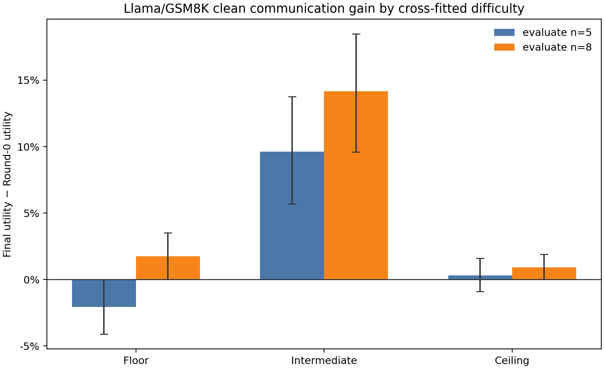

# Llama/GSM8K clean communication gain by task difficulty

## Question

Does the earlier Llama-3.1-8B/GSM8K clean-MAS experiment show the same pattern
as the two Qwen/AIME communication protocols: the largest utility gain at
intermediate task difficulty?

This is a post-hoc replication analysis motivated by the AIME result. It uses
only completed traces and makes no new model calls.

## Leakage-resistant difficulty calibration

The source contains 50 fixed GSM8K tasks evaluated on 132 graphs: 61 graphs at
`n=5` and 71 at `n=8`. Defining difficulty and gain from the same Round-0 samples
would mechanically couple the two quantities because

\[
\Delta U=U_T-U_0.
\]

The primary analysis therefore cross-fits across system size:

- evaluate `n=5` gain using task difficulty estimated only from the 71 `n=8`
  Round-0 runs;
- evaluate `n=8` gain using task difficulty estimated only from the 61 `n=5`
  Round-0 runs.

No Round-0 observation used to estimate a task's difficulty appears in the gain
evaluation for that direction. Difficulty bands extend the AIME thresholds to
continuous rates:

- floor: solve rate at most 10%;
- intermediate: solve rate between 10% and 90%;
- ceiling: solve rate at least 90%.

The independently estimated `n=5` and `n=8` task difficulties are highly
consistent (Pearson 0.988; Spearman 0.908).

## Primary result

### Difficulty calibrated on `n=8`, utility evaluated on `n=5`

| Band | Tasks | Round 0 | Final | Gain | Task-bootstrap 95% CI |
|---|---:|---:|---:|---:|---:|
| Floor | 4 | 4.51% | 2.46% | -2.05 pp | [-4.10, 0.00] |
| Intermediate | 15 | 68.42% | 78.03% | **+9.62 pp** | **[+5.68, +13.77]** |
| Ceiling | 31 | 97.30% | 97.62% | +0.32 pp | [-0.90, +1.59] |

Intermediate minus floor is +11.67 pp, with 95% CI `[+7.27, +16.37]`.
Intermediate minus ceiling is +9.30 pp, with 95% CI `[+5.24, +13.58]`.

### Difficulty calibrated on `n=5`, utility evaluated on `n=8`

| Band | Tasks | Round 0 | Final | Gain | Task-bootstrap 95% CI |
|---|---:|---:|---:|---:|---:|
| Floor | 4 | 2.46% | 4.23% | +1.76 pp | [0.00, +3.52] |
| Intermediate | 17 | 71.75% | 85.92% | **+14.17 pp** | **[+9.61, +18.48]** |
| Ceiling | 29 | 98.20% | 99.13% | +0.92 pp | [0.00, +1.89] |

Intermediate minus floor is +12.41 pp, with 95% CI `[+7.33, +17.13]`.
Intermediate minus ceiling is +13.25 pp, with 95% CI `[+8.61, +17.67]`.

The pattern is also not driven by one edge-density stratum. Intermediate gain
is the largest of the three bands at 11 of 13 `m` levels for `n=5`, and at all
15 `m` levels for `n=8`. Individual floor cells contain only four tasks and are
not interpreted separately.

## What produces the middle-band peak?

The net gain has an exact decomposition:

\[
\Delta U
=(1-U_0)P(C_T\mid \neg C_0)
-U_0P(\neg C_T\mid C_0).
\]

| Evaluation | Band | Wrong-answer correction | Correct-answer corruption |
|---|---|---:|---:|
| `n=5` | Floor | 1.29% | 72.73% |
| `n=5` | Intermediate | 58.82% | 13.10% |
| `n=5` | Ceiling | **84.31%** | 2.01% |
| `n=8` | Floor | 3.97% | 85.71% |
| `n=8` | Intermediate | 72.73% | 8.89% |
| `n=8` | Ceiling | **94.59%** | 0.79% |

The ceiling band does not have weak conditional correction. On the contrary,
its rare initially wrong readout answers are corrected most often. Its net gain
is small because almost no errors remain available to correct. At the floor,
almost all readout answers are initially wrong, but communication rarely finds
or propagates a correct solution. The intermediate band combines meaningful
headroom with a substantial probability of correction, so correction gains
outweigh corruption losses by the largest margin.

This supports a narrower statement than “intermediate tasks have the strongest
local correction law”:

> Clean multi-agent utility gain is largest where the system has both remaining
> errors and a non-negligible supply of correct solutions.

The present analysis measures task-level solve probability, not the exact
Round-0 composition of every group. Directly attributing the pattern to the
number or diversity of correct peer solutions still requires a per-run initial
composition analysis.

## Cross-setting comparison

| Model / benchmark / protocol | Floor gain | Intermediate gain | Ceiling gain |
|---|---:|---:|---:|
| Llama/GSM8K, evaluate `n=5` | -2.05 pp | **+9.62 pp** | +0.32 pp |
| Llama/GSM8K, evaluate `n=8` | +1.76 pp | **+14.17 pp** | +0.92 pp |
| Qwen/AIME, bounded-message | +7.64 pp | **+25.00 pp** | +10.42 pp |
| Qwen/AIME, full-rationale | +6.94 pp | **+25.00 pp** | +9.72 pp |

Thus the same qualitative ordering appears in two models, two datasets, two
node counts, and two AIME communication protocols. The four rows are not four
independent statistical replications: the two Llama rows share tasks, and the
two AIME rows share tasks and graphs but use independent generations and
different prompts.

## Sensitivity and claim limits

When the extreme bands are widened to floor at most 20% and ceiling at least
80%, intermediate gain remains largest in both cross-fitted directions:

- evaluate `n=5`: intermediate +11.77 pp, floor -2.05 pp, ceiling +0.70 pp;
- evaluate `n=8`: intermediate +18.69 pp, floor +1.76 pp, ceiling +1.77 pp.

Supported for the completed experiments:

1. Llama/GSM8K shows a cross-fitted intermediate-difficulty peak in raw clean
   communication gain at both `n=5` and `n=8`.
2. The ordering matches both Qwen/AIME protocols.
3. The peak reflects an opportunity balance: floor tasks lack successful
   correction, while ceiling tasks have little remaining error mass.

Not yet supported:

1. A universal law covering arbitrary models, tasks, prompts, horizons, and
   topologies.
2. The claim that intermediate tasks have the largest conditional correction
   probability; ceiling tasks have the highest observed conditional correction.
3. A uniquely LLM-specific mechanism. Finite headroom at the ceiling and lack
   of correct evidence at the floor also arise in non-LLM ensembles.
4. A precise floor-band estimate: only four GSM8K tasks fall in that band.

The next CPU analysis should condition on the actual Round-0 group composition
and compare runs with the same readout state but different numbers of initially
correct peers. That will test the proposed “correct supply plus error headroom”
mechanism rather than infer it only from task difficulty.

## Reproducibility

- Analysis script: `scripts/analyze_gsm8k_difficulty_gain.py`.
- Public outputs:
  [`docs/assets/gsm8k_llama_difficulty_gain`](assets/gsm8k_llama_difficulty_gain/).
