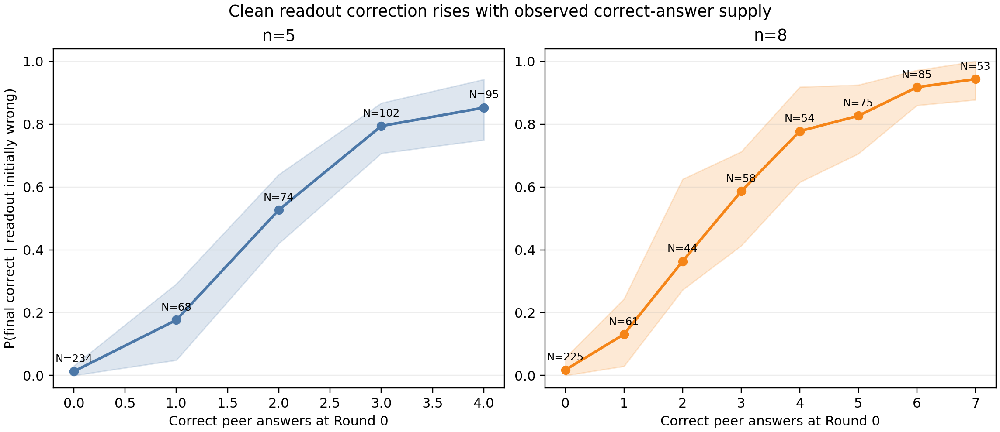

# Llama/GSM8K Round-0 correct-answer supply analysis

## Question and estimand

The analysis asks whether a clean readout that is wrong at Round 0 is more likely
to become correct at Round 3 when more peer nodes already hold a correct answer:

\[
P(C_3\mid \neg C_0,k_C).
\]

Here, `k_C` counts correct Round-0 states among all non-readout nodes. The
analysis uses the 6,600 completed clean task–graph runs from the
Llama-3.1-8B/GSM8K experiment. Of these, 1,228 runs have a non-correct Round-0
readout and form the analysis population. `not C0` includes target, other-error,
and unparsed states; without an attacker, all three are simply non-correct
initial outcomes.

The compact clean state file was extracted from the original raw clean traces.
It was not reconstructed from attack runs: attacker-position runs independently
regenerated normal nodes and therefore cannot be combined into a synthetic
clean state vector.

## Main result

| `n` | Correct peers `k_C` | Runs | Tasks | Correction rate | Task-bootstrap 95% CI |
|---:|---:|---:|---:|---:|---:|
| 5 | 0 | 234 | 9 | 1.28% | [0.00%, 3.08%] |
| 5 | 1 | 68 | 13 | 17.65% | [4.88%, 29.17%] |
| 5 | 2 | 74 | 17 | 52.70% | [42.03%, 64.00%] |
| 5 | 3 | 102 | 21 | 79.41% | [70.73%, 86.73%] |
| 5 | 4 | 95 | 29 | 85.26% | [75.00%, 94.25%] |
| 8 | 0 | 225 | 7 | 1.78% | [0.00%, 5.66%] |
| 8 | 1 | 61 | 7 | 13.11% | [2.94%, 24.42%] |
| 8 | 2 | 44 | 9 | 36.36% | [27.27%, 62.50%] |
| 8 | 3 | 58 | 15 | 58.62% | [41.30%, 71.23%] |
| 8 | 4 | 54 | 13 | 77.78% | [61.54%, 91.84%] |
| 8 | 5 | 75 | 16 | 82.67% | [70.59%, 92.50%] |
| 8 | 6 | 85 | 25 | 91.76% | [86.00%, 97.17%] |
| 8 | 7 | 53 | 23 | 94.34% | [87.76%, 100.00%] |

The association is monotone in both system sizes. It also remains visible
within the same task rather than arising only from comparisons between easy and
hard tasks. Among tasks with variation in both `k_C` and final outcome:

- `n=5`: 15 of 18 task-specific rank associations are positive; median
  Spearman correlation is 0.508;
- `n=8`: 18 of 19 are positive; median Spearman correlation is 0.447.

The corresponding exploratory one-sided sign-test p-values are 0.0038 and
0.000038. These are post-hoc diagnostics, not preregistered confirmatory tests.

## Connection to the intermediate-difficulty peak

Among runs where the readout is initially wrong:

| `n` | Difficulty band | Runs | Mean `k_C` | Any correct peer | Correction rate |
|---:|---|---:|---:|---:|---:|
| 5 | Floor | 233 | 0.12 | 11.59% | 1.29% |
| 5 | Intermediate | 289 | 2.36 | 90.31% | 58.82% |
| 5 | Ceiling | 51 | 3.75 | 100.00% | 84.31% |
| 8 | Floor | 277 | 0.24 | 20.22% | 3.97% |
| 8 | Intermediate | 341 | 4.36 | 98.83% | 72.73% |
| 8 | Ceiling | 37 | 6.51 | 100.00% | 94.59% |

This directly clarifies the earlier net-gain result. Floor tasks seldom contain
a correct peer solution when the readout is wrong. Ceiling tasks almost always
do, and their rare readout errors are usually corrected, but there are very few
such errors left. Intermediate tasks frequently produce a mixed state—an
incorrect readout alongside several correct peers—while retaining much more
error headroom than ceiling tasks. That combination produces the largest net
utility gain.

The supported statement is therefore that observed correct-answer availability
is a strong predictor of correction and explains the opportunity structure
behind the middle-band peak. The current analysis does not prove that adding
one correct answer by intervention would cause the corresponding increase.

## Topology and arrival time

Every sampled graph was constrained so that every non-readout node can reach
the readout within `H=3`. Consequently:

\[
k_C^{\text{reachable within 3}}=k_C
\]

for every run. This requested variable has no variation and cannot explain
outcome differences in this dataset.

The useful topology variable is instead the shortest path from any initially
correct peer to the readout. The current conditional evidence is not stable:

- after matching within task and `k_C`, `n=5` has 10 positive and 4 negative
  distance–correction rank associations across 14 eligible strata;
- `n=8` has 2 positive, 7 negative, and 1 zero association across 10 eligible
  strata.

Many distance cells are small, especially for distance 3. We therefore do not
claim yet that earlier structural arrival improves correction. The strong
result from this step is correct-answer supply; the additional routing effect
remains unresolved.

## Claim limits

1. This is an observational conditional analysis. `k_C` was generated by the
   model rather than experimentally assigned.
2. Conditioning on the same task substantially weakens the task-difficulty
   confound, but does not control reasoning quality or diversity among correct
   messages.
3. Structural reachability means a message can influence the readout through
   the update chain; it does not prove that intermediate agents preserve the
   original reasoning.
4. The timing analysis has limited matched support and should not be used as a
   topology claim.

## Reproducibility

- Raw-trace extractor: `scripts/extract_clean_round0_cases.py`.
- Analysis: `scripts/analyze_round0_correct_supply.py`.
- Machine-readable outputs:
  `docs/assets/gsm8k_round0_correct_supply/`.
