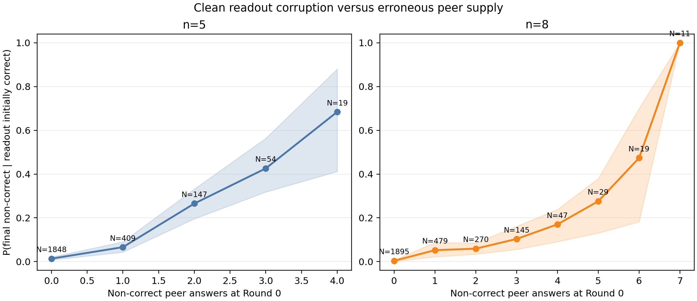

# Llama/GSM8K Round-0 error-supply analysis

## Question and definitions

This analysis takes clean runs whose readout is correct at Round 0 and estimates

\[
P(\neg C_3\mid C_0,k_{\neg C}),
\]

where `k_notC` is the number of non-correct Round-0 peer states. The primary
definition includes target, other-error, and unparsed states. A sensitivity
analysis uses only parsed wrong answers (`target + other`) and excludes
unparsed outputs.

The analysis population contains 5,372 initially correct readout runs from the
same 6,600 clean Llama-3.1-8B/GSM8K task–graph runs used in the correct-supply
analysis.

## Primary corruption curve

| `n` | Non-correct peers `k_notC` | Runs | Tasks | Corruption rate | Task-bootstrap 95% CI |
|---:|---:|---:|---:|---:|---:|
| 5 | 0 | 1,848 | 45 | 1.35% | [0.75%, 2.07%] |
| 5 | 1 | 409 | 41 | 6.60% | [4.32%, 9.04%] |
| 5 | 2 | 147 | 23 | 26.53% | [19.55%, 33.17%] |
| 5 | 3 | 54 | 16 | 42.59% | [31.82%, 56.36%] |
| 5 | 4 | 19 | 9 | 68.42% | [41.18%, 88.00%] |
| 8 | 0 | 1,895 | 45 | 0.37% | [0.11%, 0.70%] |
| 8 | 1 | 479 | 39 | 5.22% | [2.16%, 8.76%] |
| 8 | 2 | 270 | 27 | 5.93% | [3.39%, 8.55%] |
| 8 | 3 | 145 | 19 | 10.34% | [5.56%, 16.15%] |
| 8 | 4 | 47 | 14 | 17.02% | [9.09%, 23.81%] |
| 8 | 5 | 29 | 8 | 27.59% | [13.04%, 38.00%] |
| 8 | 6 | 19 | 8 | 47.37% | [18.18%, 70.00%] |
| 8 | 7 | 11 | 6 | 100.00% | [100.00%, 100.00%] |

The point estimates rise monotonically in both system sizes. The extreme cells
have limited support: in particular, the apparent 100% rate for `n=8,
k_notC=7` is based on only 11 runs and six tasks.

The result is not caused only by treating unparsed messages as errors. When
`k` counts parsed wrong answers only, the same broad increase remains. For
example, the `n=5` corruption rate rises from 1.61% with zero parsed wrong peers
to 56.10% with three; the four-error cell is noisier and contains only 11 runs.

## Within-task diagnostic

Among tasks where both error supply and the final outcome vary:

- `n=5`: 23 of 29 task-specific rank associations are positive; median
  Spearman correlation is 0.201;
- `n=8`: 22 of 26 are positive; median Spearman correlation is 0.208.

Exploratory one-sided sign-test p-values are 0.0012 and 0.00027. Thus the
relationship remains visible when comparing different runs of the same task,
although it is weaker than the corresponding correct-supply relationship.

## Relation to task difficulty

| `n` | Difficulty | Initially correct runs | Mean `k_notC` | Any non-correct peer | Corruption rate |
|---:|---|---:|---:|---:|---:|
| 5 | Floor | 11 | 4.00 | 100.00% | 72.73% |
| 5 | Intermediate | 626 | 1.10 | 68.69% | 13.10% |
| 5 | Ceiling | 1,840 | 0.11 | 10.22% | 2.01% |
| 8 | Floor | 7 | 6.71 | 100.00% | 85.71% |
| 8 | Intermediate | 866 | 1.86 | 82.56% | 8.89% |
| 8 | Ceiling | 2,022 | 0.16 | 13.75% | 0.79% |

Floor-band rows are based on only 11 and seven initially correct runs and are
descriptive. The stable contrast is between intermediate and ceiling tasks:
initially correct intermediate runs are exposed to substantially more erroneous
peer states and are corrupted more often.

## Combined interpretation with correct supply

The two analyses now provide complementary empirical curves:

\[
\text{correct peer supply}\uparrow
\quad\Rightarrow\quad
P(C_3\mid\neg C_0)\uparrow,
\]

and

\[
\text{non-correct peer supply}\uparrow
\quad\Rightarrow\quad
P(\neg C_3\mid C_0)\uparrow.
\]

This explains clean communication as the balance of two opportunities:
correction when correct peer solutions exist, and corruption when erroneous
peer solutions dominate. It does not establish that peer counts alone are a
sufficient law: message quality, agreement among wrong answers, topology, and
reasoning diversity remain unmeasured at this stage.

## Topology and arrival

As before, every non-readout node can reach the readout within `H=3`, so the
number of non-correct peers reachable within the full horizon equals
`k_notC` exactly. After matching within task and `k_notC`, shortest error-source
distance has a weak negative tendency—consistent with closer errors being more
dangerous—but it is not stable enough across both system sizes for a claim.

## Claim limits

1. Peer error supply is observed, not experimentally assigned; the curves are
   associational rather than causal dose-response functions.
2. Same-task comparisons reduce difficulty confounding but do not control the
   semantic quality, diversity, or agreement of erroneous messages.
3. Extreme error-count cells are rare and have wide uncertainty.
4. A non-correct state does not necessarily carry one unit of equivalent
   evidence. In particular, unparsed and coherent wrong rationales may have very
   different effects.

## Reproducibility

- Analysis: `scripts/analyze_round0_error_supply.py`.
- Shared clean-state extraction: `scripts/extract_clean_round0_cases.py`.
- Machine-readable outputs: `docs/assets/gsm8k_round0_error_supply/`.
