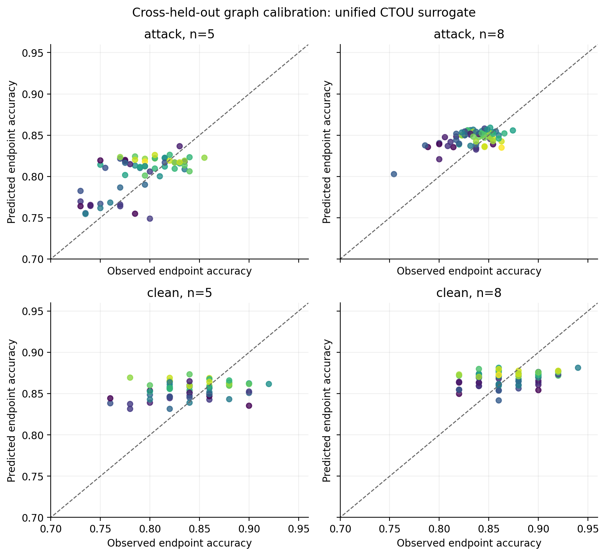
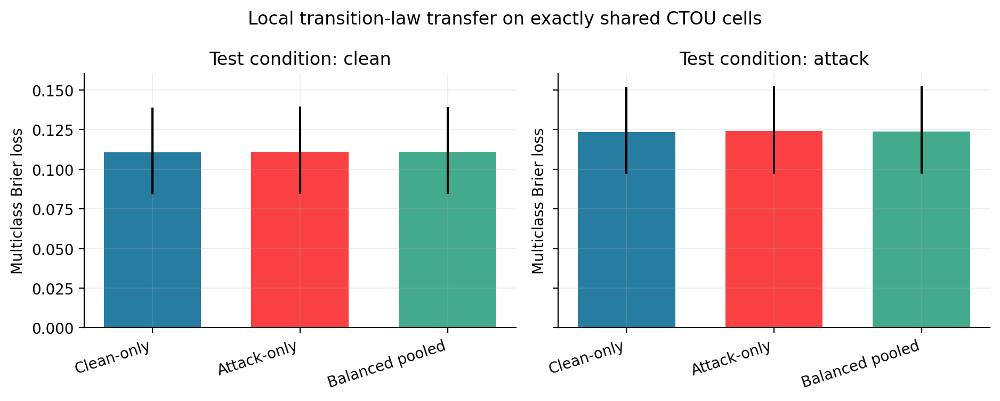
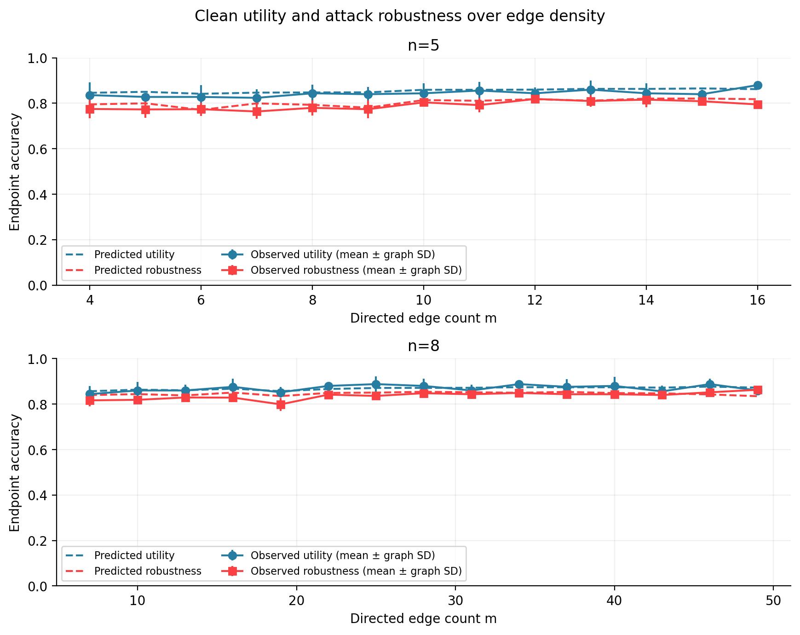
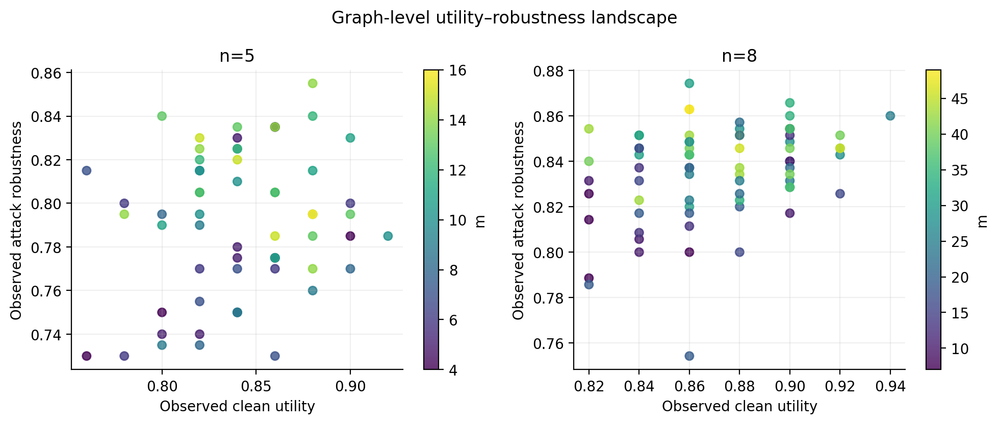

# Clean utility、共享局部律与 Utility–Robustness 曲线

## 结论摘要

这轮实验支持三个有限但重要的结论。

1. **CTOU 不只适用于 persistent-target attack。** 在 clean condition 中，它比 persistence 和 equal-weight DeGroot 更好地恢复最终 utility；通信相对独立 Round 0 平均提高约 2.9（`n=5`）和 5.5（`n=8`）个百分点。
2. **现有结果更符合 “attack 改变 composition support，而非在共享 CTOU cell 上大幅改变局部响应律”。** clean-only law 无法覆盖大量含 `T` 的 attack 输入，但在 clean/attack 共同出现的完全相同 CTOU cell 上，三套 law 的误差非常接近；balanced pooled law 在两域都接近各自专用 law。
3. **当前 50 题 pilot 没有显示 utility–robustness trade-off。** `n=5` 中 utility 和 robustness 均随边数呈正趋势；`n=8` 中 robustness 呈正趋势，而 utility 趋势区间包含零。两条曲线均有局部起伏，不能声称逐边单调。

同时，当前 CTOU 还不能称为完整 topology evaluator。它对 graph-level endpoint 的绝对误差较小，但图排序仅中等；尤其没有恢复 `n=8` 的 robustness–density 趋势。这是下一步最值得解释的缺口。

## 1. 实验与信息边界

- 数据：既有 Llama-3.1-8B、GSM8K 固定 50 题、132 张图的 clean/attack traces。
- 图：`n=5` 共 61 张，`n=8` 共 71 张；除 complete graph 外，每个 `(n,m)` 通常有 5 张图。
- clean 更新：76,350 条唯一 `(task, graph, receiver, round)` 更新。相同 clean trace 不因多个 attacker condition 重复计数。
- attack 更新：394,800 条。
- 交叉验证：5 个 graph folds × 5 个 task folds；测试图和测试题同时不参与 law 拟合。
- 局部 law：clean-only、attack-only、condition-balanced pooled。pooled 不包含 condition feature，且 clean/attack 两域总权重各为 50%。
- primary surrogate：balanced pooled law + correlated empirical Round-0 initializer + joint particle rollout。initializer 只知道训练任务中的完整初始状态向量分布，不读取测试题的 Round-0 状态。

本轮没有新增 LLM 调用，全部为现有 trace 上的 CPU 分析。

## 2. CTOU 能否描述 benign aggregation？

### 2.1 clean 通信的实际收益

| 节点数 | Round-0 utility | Final utility | `Final − Round 0` |
|---:|---:|---:|---:|
| 5 | 81.21% | 84.13% | **+2.92 pp** `[1.08, 4.89]` |
| 8 | 81.55% | 87.04% | **+5.49 pp** `[3.27, 7.94]` |

区间为按 task 配对 bootstrap；它以当前采样图集合为条件，不包含“重新采样图空间”的不确定性。

### 2.2 使用真实 Round 0 时，CTOU 优于简单传播基线

下表报告 graph-level clean endpoint accuracy 的 MAE / Spearman。

| 模型 | `n=5` | `n=8` |
|---|---:|---:|
| Clean-specific CTOU | 2.82 pp / 0.425 | 2.16 pp / 0.465 |
| Balanced pooled CTOU | 2.94 pp / 0.435 | **2.14 pp / 0.465** |
| Equal-weight DeGroot | 3.89 pp / 0.332 | 6.31 pp / 0.065 |
| Persistence | 4.89 pp / 0.028 | 5.61 pp / 0.073 |

因此，CTOU 的成功不只来自攻击者持续提供 `T`。在只有 `C/O/U` 纠错与错误传播的 clean condition 中，局部状态转移仍提供了简单平均或不更新基线没有捕获的信息。

这不表示四状态已经充分。即使输入真实 Round 0，CTOU 的图排序也只有中等相关。

### 2.3 不读取测试题 Round 0 的完整 surrogate

| Condition | `n=5` MAE / Spearman | `n=8` MAE / Spearman |
|---|---:|---:|
| Clean | 3.03 pp / 0.276 | 2.44 pp / 0.320 |
| Attack robustness | 2.32 pp / 0.499 | 1.67 pp / 0.292 |

它能给出较合理的平均 endpoint 水平，但尚不足以可靠排序所有 topology。

## 3. clean 与 attack 是否需要两套 transition law？

### 3.1 先区分 support shift 和 response-law shift

完全相同的 CTOU cell 定义为相同：

`previous state + round + C/T/O/U incoming counts`。

这些共享 cell 覆盖：

- clean 更新的 98.4%；
- attack 更新的 38.3%。

attack 中大量含 `T` 的 composition 在 clean 中从未出现。因此，clean-only law 在完整 attack support 上失效，并不能单独证明“同一局部输入在攻击条件下产生了不同响应”。

### 3.2 完整 support 上的 one-step 结果

| Test condition | Reference law | Balanced pooled 相对 reference 的 multiclass Brier 差值 |
|---|---|---:|
| Clean | Clean-specific | +0.000085 `[-0.000127, 0.000305]` |
| Attack | Attack-specific | +0.000483 `[0.000068, 0.000896]` |

pooled 在 attack 上有一个统计可分辨但绝对很小的损失。相比之下，clean-only law 直接用于完整 attack support 时，Brier 增加 0.0200 `[0.0122, 0.0296]`，主要反映它没有学到 `T` 相关区域。

### 3.3 只比较完全共享 cell

| Test condition | Clean-only | Attack-only | Balanced pooled |
|---|---:|---:|---:|
| Clean | 0.11071 | 0.11110 | 0.11083 |
| Attack | 0.12337 | 0.12398 | 0.12364 |

三者 multiclass Brier 的差异都小于约 `6e-4`。在共享 attack cells 上，pooled 甚至略优于 attack-only（差值 −0.000342，95% CI `[-0.000635, -0.000061]`）。

因此，当前证据与以下解释相容：

> attack 首先改变节点收到的 composition 分布；在相同 CTOU 输入上，尚未观察到大的 condition-specific response shift。

但不能据此证明两域的真实语义转移律完全相同。共享-cell 分析没有控制具体自然语言内容、来源身份、论证质量和消息相关性。

## 4. `m → Utility` 与 `m → Robustness`

### 4.1 观察到的密度趋势

| `n` | Outcome | 每增加一条边的线性斜率 | curve Spearman |
|---:|---|---:|---:|
| 5 | Utility | **+0.281 pp** `[+0.073, +0.495]` | 0.705 `[0.047, 0.808]` |
| 5 | Robustness | **+0.386 pp** `[+0.124, +0.638]` | 0.758 `[0.319, 0.896]` |
| 8 | Utility | +0.040 pp `[−0.030, +0.108]` | 0.397 `[−0.086, 0.624]` |
| 8 | Robustness | **+0.094 pp** `[+0.030, +0.150]` | 0.831 `[0.261, 0.914]` |

区间按 task bootstrap。它们表示总体趋势，不表示每次增加一条边都会改善结果；相邻 `m` 水平存在多次反向变化。

### 4.2 目前不支持 utility–robustness trade-off

graph-level observed Utility–Robustness Spearman 为：

- `n=5`: 0.151，task-bootstrap 区间跨零；
- `n=8`: 0.315，task-bootstrap 区间约 `[0.027, 0.349]`。

至少在这 50 题、当前攻击协议和采样图中，没有观察到“utility 上升而 robustness 系统性下降”的负相关。更接近的现象是两者总体同向改善，但局部存在明显 topology variation。

此区间只重采样 task、固定当前图，不能外推为整个合法图空间的相关性。

## 5. CTOU 作为 topology surrogate 的当前边界

### 5.1 它恢复了什么

基于 pooled + correlated initializer 的 `m`-curve：

| `n` | Curve | level MAE | observed-vs-predicted Spearman |
|---:|---|---:|---:|
| 5 | Utility | 1.40 pp | 0.634 |
| 5 | Robustness | 1.36 pp | 0.762 |
| 8 | Utility | 0.95 pp | 0.621 |
| 8 | Robustness | 1.43 pp | **0.226** |

作为 topology search 的更严格检查，预测 Pareto set 与观测 Pareto set 在 `n=5` 没有重合；在 `n=8` 只覆盖 3 个观测 Pareto 图中的 2 个（预测集合共 5 个）。这个结果受 50 题估计噪声影响，只作描述，但足以说明当前 surrogate 尚不适合直接替代真实 rollout 进行最优图选择。

### 5.2 最关键的失败：`n=8` robustness density trend

`n=8` 中：

- observed robustness slope: `+9.44e-4 / edge`；
- pooled predicted slope: `+6.17e-5 / edge`；
- attack-specific predicted slope: `+1.36e-4 / edge`；
- attack-specific + oracle Round 0: `+2.49e-4 / edge`。

换成 attack-only law 或直接提供真实 Round 0 都不能恢复大部分趋势。因此，缺口不能只归因于 pooled law 或初始化误差。

目前可以列出、但尚未验证的候选原因包括：

1. CTOU 只计数状态，不保留消息来源、论证内容和同源错误的语义相关性；
2. particle rollout 在给定 composition 后独立采样节点转移，可能丢失同一题中多个节点的联合响应；
3. 相同 count composition 在不同 topology 中可能对应不同 provenance/path history；
4. 局部 one-step 小误差在三轮递推后可能系统性累积。

这些是后续需要区分的解释，不是本轮已确认的机制。

## 6. 下一步建议

第一优先级不应立即做 topology search，而应先解释 `n=8` robustness curve 缺口，且可优先使用现有 trace：

1. **联合转移残差分析**：在相同 CTOU cell 下，检查同 task、同 round 的多个 receiver 是否存在超出独立模型的相关响应。
2. **provenance-aware 后处理**：在不调用 LLM 的前提下，为 composition 增加“来自多少独立上游/是否同源于 attacker/路径重合度”等图上可计算字段，判断能否恢复 `n=8` 趋势。
3. **误差分解**：按 round 比较 oracle composition one-step、递推 composition、最终 endpoint 三层误差，确定误差主要来自 local law 还是 rollout closure。
4. **SupportRisk**：把测试 cell 的训练支持度与 endpoint 误差关联，形成 prediction reliability 输出。

只有在这些分析后，若 surrogate 能稳定恢复 clean utility、attack robustness 和主要 density curve，再把它用于 topology search 才有足够依据。

## 7. 可复现文件

- 主分析：`scripts/analyze_ctou_clean_utility.py`
- task-bootstrap 后处理：`scripts/analyze_ctou_clean_utility_posthoc.py`
- 绘图：`scripts/plot_ctou_clean_utility.py`
- 预注册协议：`docs/ctou_clean_utility_protocol.md`
- 结果表：`artifacts/llama31-8b-dense50-ctou-clean-utility-v1/`
