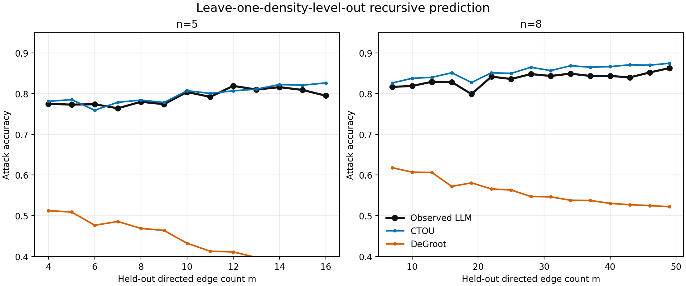
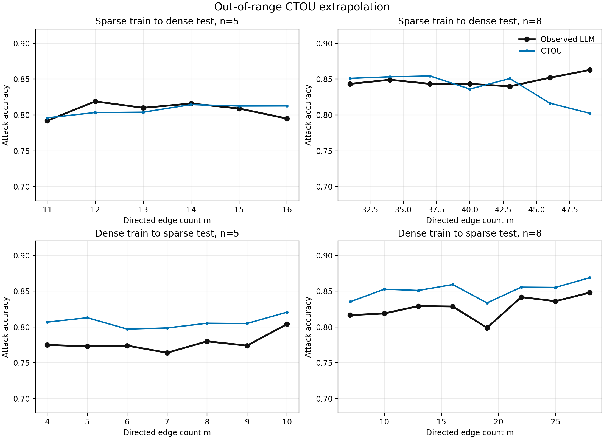
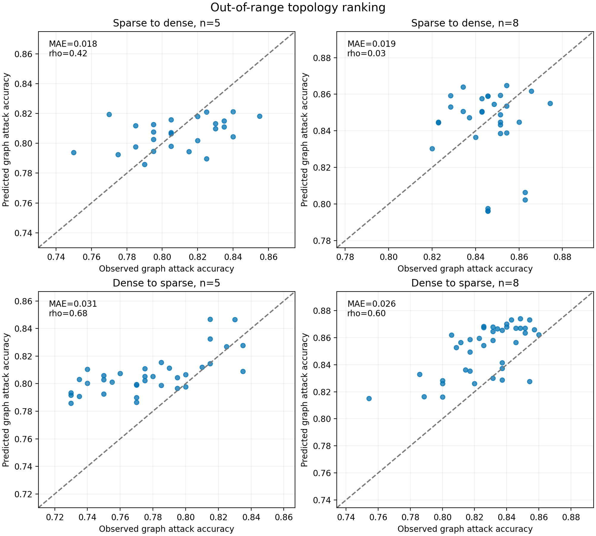
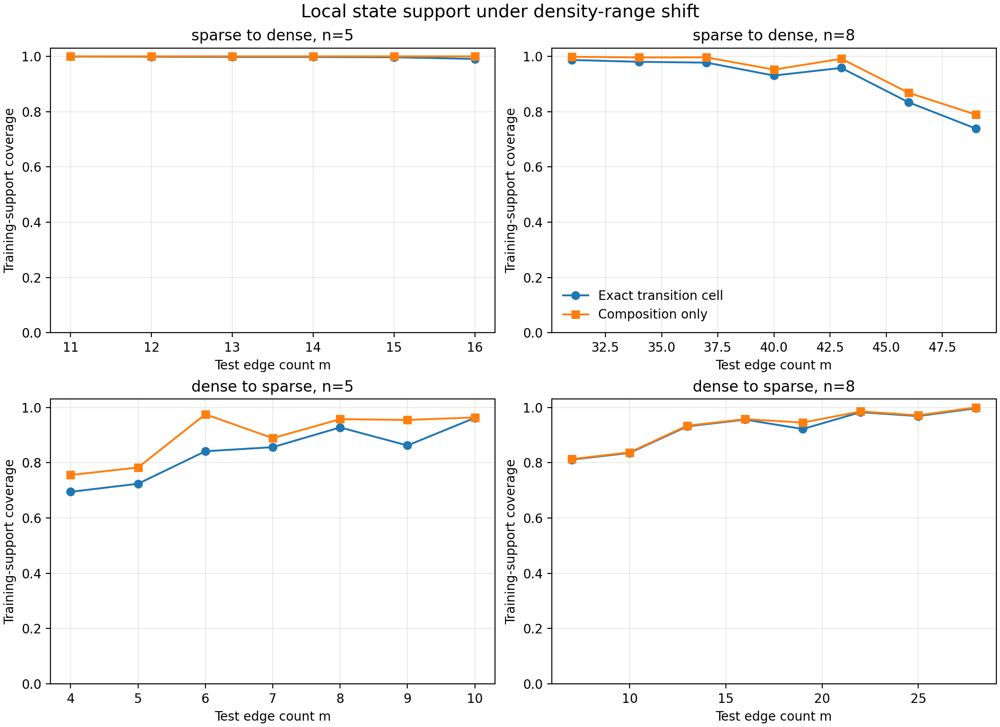

# CTOU 密度外推实验结果

## 1. 结论摘要

本轮实验完成了两类检验：

1. **leave-one-density-level-out**：完全移除一个 `(n,m)` 密度层后，递归预测该密度层；
2. **range extrapolation**：只用稀疏图拟合后预测稠密图，以及反向只用稠密图预测稀疏图。

主要结论是：

> CTOU 的局部状态转移规律能够在已采样密度范围内迁移到未见密度层，但区间外推只获得部分、方向不对称的成功。总体 endpoint 校准与 topology ranking 是两种不同能力，不能用一个指标替代另一个。

留一密度层时，即使同时排除测试 task fold，CTOU 的 endpoint loss 与原先的域内交叉验证基本一致，attack-accuracy 的图级排序仍保持中等相关。它不是简单记住某个 `m` 对应的输出率。

完整区间外推则不能概括为“成功”或“失败”：

- 稀疏训练、稠密测试时，总体 endpoint rate 仍较准，但特别在 `n=8` 的极高密度端发生低估，图级排序也明显变弱；
- 稠密训练、稀疏测试时，图级排序保持较好，但模型系统性高估 attack accuracy，即校准偏乐观；
- CTOU 在所有外推设置中仍明显优于 persistence 和等权 DeGroot。

因此，当前证据支持“**局部动力学具有可迁移性**”，不支持“**已经得到与密度无关、可任意外推的普适定律**”。

## 2. 实验对象与信息边界

数据来自 Llama-3.1-8B 的 50 题 GSM8K dense pilot：

- 50 个任务；
- 132 张图；
- 28 个 `(n,m)` 密度层；
- 37,050 个 attack endpoint；
- 394,800 条正常节点 transition；
- `n=5` 的稀疏/稠密边界为 `m=10`；
- `n=8` 的边界为 `m=28`。

递归 rollout 仅观察：

- 真实 Round-0 的 C/T/O/U 状态；
- 通信图；
- attack node；
- 原实验 schedule。

Round 1 以后不再读取真实节点状态、真实 incoming composition、答案文本或最终结果。CTOU 使用的局部转移是：

\[
P\left(S_i^{(t)}\mid S_i^{(t-1)},t,C_i^{(t)},T_i^{(t)},O_i^{(t)},U_i^{(t)}\right).
\]

本轮沿用 mean-field rollout。上一轮实验已经确认它与 joint particle rollout 的 graph-level 差异很小，因此没有为外推实验重复昂贵的 particle 计算。

状态标签以执行时 Oracle 保存的 `answer_state` 为准。表面字符串解析仅用于旧数据回退，避免将 `11/5` 与 `2.2` 等等价答案误分为不同状态。

## 3. 验证协议

### 3.1 留一密度层

对每个 `(n,m)`，训练 transition table 时删除该密度层的所有更新，随后只在该层递归 rollout。

包含两个 scope：

- `density_only`：允许相同任务出现在其他密度层；
- `density_task`：除密度层外，再删除测试 task fold。

每张测试图天然未见，因为一张图只属于一个密度层。

### 3.2 区间外推

- `sparse_to_dense`：用 `m<=10 (n=5)` 或 `m<=28 (n=8)` 拟合，测试更稠密区域；
- `dense_to_sparse`：反方向拟合和测试；
- 同样分别运行 `density_only` 和 `density_task`。

主报告优先使用更严格的 `density_task`。

## 4. 留一密度层：局部规律可以在采样范围内重组

### 4.1 Endpoint loss

严格 `density_task` 下，CTOU 的平均 Brier loss 为：

| 指标 | CTOU | DeGroot | Persistence |
|---|---:|---:|---:|
| Multiclass Brier | 0.2123 | 0.4393 | 0.3861 |
| Target Brier | 0.0501 | 0.1601 | 0.0547 |
| Correct Brier | 0.0920 | 0.2011 | 0.1671 |

与原先域内 CTOU 对同一 endpoint 的配对比较：

| 指标 | OOD loss − in-domain loss | 95% CI |
|---|---:|---:|
| Multiclass Brier | -0.00011 | [-0.00031, 0.00007] |
| Target Brier | -0.00001 | [-0.00005, 0.00003] |
| Correct Brier | -0.00005 | [-0.00016, 0.00005] |

差异基本为零。这里不能表述为 OOD 模型“更好”；合理结论是：移除完整密度层没有造成可检测的 endpoint degradation。

### 4.2 密度曲线和图级排序

| Scope | n | Correct curve MAE | Curve Spearman | Graph MAE | Graph Spearman (95% CI) |
|---|---:|---:|---:|---:|---:|
| density only | 5 | 0.0080 | 0.773 | 0.0190 | 0.715 [0.560, 0.825] |
| density only | 8 | 0.0153 | 0.885 | 0.0184 | 0.675 [0.503, 0.806] |
| density + task | 5 | 0.0101 | 0.773 | 0.0197 | 0.721 [0.572, 0.825] |
| density + task | 8 | 0.0179 | 0.853 | 0.0203 | 0.676 [0.506, 0.802] |

严格排除 task fold 后结果几乎没有改变。CTOU 因而不仅能恢复平均 endpoint rate，也能在采样范围内保留一部分 graph ranking。

Target-risk 的图级排序仍弱：`n=5` 的 Spearman 约 0.23，`n=8` 约 0.04，置信区间均包含零。当前最强结果仍然是 attack accuracy，而不是低发生率 target endpoint 的拓扑排序。

## 5. 区间外推：校准与图排序表现不对称

### 5.1 严格 scope 下的总体 endpoint rate

| 方向 | n | Observed target | Predicted target | Observed correct | Predicted correct |
|---|---:|---:|---:|---:|---:|
| Sparse → dense | 5 | 0.0740 | 0.0784 | 0.8087 | 0.8063 |
| Sparse → dense | 8 | 0.0446 | 0.0412 | 0.8458 | 0.8424 |
| Dense → sparse | 5 | 0.0744 | 0.0648 | 0.7777 | 0.8066 |
| Dense → sparse | 8 | 0.0421 | 0.0315 | 0.8272 | 0.8514 |

稀疏训练模型在稠密区间的总体校准较好。稠密训练模型在稀疏区间则系统性低估 target，并高估约 2.4–2.9 个百分点的 attack accuracy。

配对 loss 相对域内 CTOU 的变化为：

| 方向 | Metric | OOD − in-domain | 95% CI |
|---|---|---:|---:|
| Sparse → dense | Multiclass Brier | +0.01243 | [0.00544, 0.02037] |
| Sparse → dense | Target Brier | +0.00034 | [0.00002, 0.00063] |
| Sparse → dense | Correct Brier | +0.00670 | [0.00341, 0.01019] |
| Dense → sparse | Multiclass Brier | +0.00196 | [-0.00042, 0.00477] |
| Dense → sparse | Target Brier | -0.00020 | [-0.00061, 0.00022] |
| Dense → sparse | Correct Brier | +0.00120 | [-0.00026, 0.00293] |

这说明稀疏→稠密虽然总体均值接近，task-level 概率误差仍有小幅、可检测的增加；均值校准不能替代逐 task 的 proper scoring rule。

### 5.2 图级排序

| 方向 | n | Graph MAE | Graph Spearman | 95% CI |
|---|---:|---:|---:|---:|
| Sparse → dense | 5 | 0.0179 | 0.424 | [0.001, 0.748] |
| Sparse → dense | 8 | 0.0193 | 0.025 | [-0.339, 0.376] |
| Dense → sparse | 5 | 0.0310 | 0.676 | [0.413, 0.832] |
| Dense → sparse | 8 | 0.0260 | 0.603 | [0.329, 0.789] |

稠密→稀疏虽然绝对校准偏乐观，仍保留较好的 graph ordering；稀疏→稠密总体均值较准，但 `n=8` 的图排序几乎消失。

因此 topology evaluator 至少需要分开评价：

1. **calibration**：预测绝对 endpoint rate；
2. **ranking**：区分同一区域内哪些图更好。

本轮每个 `m` 通常只有 5 张图，单一密度层内部的 rank 估计噪声较大。上述 graph Spearman 是跨整个测试区间的结果，不能进一步声称模型已稳定恢复“同一 `m` 内的细微 topology ordering”。

## 6. Composition-support 诊断

为判断外推误差是否只是 lookup table 遇到未见 cell，额外计算两种覆盖率：

- **Exact transition cell**：`previous state + round + C/T/O/U counts` 全部在训练中出现；
- **Composition only**：仅 incoming C/T/O/U counts 在训练中出现。

这是预测完成后的 post-hoc 诊断，测试信息没有进入 rollout。

### 6.1 加权覆盖率

| 实验 | n | Exact coverage | Composition coverage |
|---|---:|---:|---:|
| Leave level out | 5 | 99.95% | 100.00% |
| Leave level out | 8 | 99.67% | 99.98% |
| Sparse → dense | 5 | 99.76% | 100.00% |
| Sparse → dense | 8 | 93.51% | 95.90% |
| Dense → sparse | 5 | 84.22% | 89.75% |
| Dense → sparse | 8 | 93.13% | 93.59% |

留一密度层几乎没有 support 缺口，因此其成功不是依赖大量 fallback。

区间外推的两端则出现局部状态 OOD：

- 稀疏→稠密 `n=8,m=49` 的 exact coverage 降到 73.8%，observed/predicted correct 为 0.8629/0.8023；
- 稠密→稀疏 `n=5,m=4` 的 exact coverage 为 69.5%，correct 绝对误差为 0.0318；
- `n=5,m=5` 覆盖率 72.4%，correct 绝对误差为 0.0399。

这说明极端密度误差的一部分可以由局部 composition support 解释。不过，它不能完整解释稀疏→稠密的 graph-ranking 下降：多数稠密测试层仍有很高覆盖，而且每个 `m` 仅有 5 张图，排序还受到小样本和跨密度趋势误配影响。

## 7. 与非 LLM 动力学基线的比较

严格 `density_task` 下：

| Experiment | Model | Multiclass Brier | Target Brier | Correct Brier |
|---|---|---:|---:|---:|
| Leave level | CTOU | 0.2123 | 0.0501 | 0.0920 |
| Leave level | DeGroot | 0.4393 | 0.1601 | 0.2011 |
| Leave level | Persistence | 0.3861 | 0.0547 | 0.1671 |
| Sparse → dense | CTOU | 0.2090 | 0.0517 | 0.0927 |
| Sparse → dense | DeGroot | 0.4612 | 0.1781 | 0.2174 |
| Sparse → dense | Persistence | 0.3823 | 0.0559 | 0.1672 |
| Dense → sparse | CTOU | 0.2265 | 0.0489 | 0.0979 |
| Dense → sparse | DeGroot | 0.4226 | 0.1463 | 0.1886 |
| Dense → sparse | Persistence | 0.3890 | 0.0538 | 0.1671 |

等权 DeGroot 在所有 shift 下都明显偏向过度混合 target error。Persistence 对低发生率 target 的 Brier 看似接近 CTOU，但无法预测 attack accuracy，也不包含通信动力学。CTOU 的优势来自条件化的局部、非线性状态转移，而不是仅仅保留 Round-0 状态或做线性邻居平均。

## 8. 当前允许的 claim

### 有把握

1. 在当前 Llama-3.1-8B、GSM8K、固定错误攻击协议下，Round-0 状态与局部 CTOU 转移足以递归恢复大部分 aggregate attack-accuracy dynamics。
2. CTOU 能迁移到采样范围内完全未见的密度层和未见 task fold，且 endpoint loss 没有可检测退化。
3. CTOU 在留密度和区间外推中均明显优于等权 DeGroot 与 persistence。
4. 区间外推存在方向不对称，且 absolute calibration 与 graph ranking 必须分别评价。
5. 极端密度的一部分外推误差与局部 transition-cell support 缺口一致。

### 目前不能声称

1. CTOU 是跨模型、跨数据集或跨攻击协议的普适动力学定律；
2. CTOU 可以可靠预测任意未见密度范围；
3. 当前模型能够稳定排序 target-risk，特别是 `n=8`；
4. 外推失败完全由 composition OOD 引起；
5. 四状态压缩保留了语义内容的全部因果作用。

## 9. 下一步建议

这轮结果已经完成了“是否只记住精确密度层”的排除。下一步不宜继续重复增加随机图，而应检验四状态压缩的失效边界：

1. 先做一个无需新 LLM 的 **support-stratified error analysis**，把 endpoint 按 rollout 经过的未见/低支持 cell 风险分层，确认 support 缺口能解释多少外推误差；
2. 随后选择一种更隐蔽但仍可 Oracle 验证的 target error，保持图和任务不变，检验相同 CTOU composition 下不同错误语义是否产生系统性残差；
3. 再迁移到 MATH 或第二个模型，检验 transition law 与图排序是否稳定。

其中第二步才真正开始回答：CTOU 的四状态动力学在哪些条件下不足，必须引入何种语义信息。当前结果不应提前假定语义一定必要。

## 10. 产物

- 协议：`docs/ctou_density_extrapolation_protocol.md`
- 分析：`scripts/analyze_ctou_density_extrapolation.py`
- 绘图：`scripts/plot_ctou_density_extrapolation.py`
- 测试：`tests/test_ctou_density_extrapolation.py`
- 汇总数据：`artifacts/llama31-8b-dense50-ctou-density-extrapolation-v1/`
- 图片：`docs/assets/ctou_density_extrapolation/`
