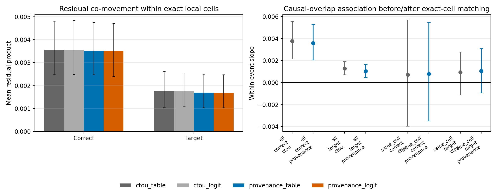

# CTOU 联合转移残差分析

## 1. 结论摘要

本轮把 CTOU 的第二个缺失信息候选拆成了两个问题：

1. 在给定各节点自己的局部状态和 composition 后，多个节点的下一状态是否仍然相关？
2. 如果相关，这种相关性是否随共享上游结构系统性变化，从而可能解释 topology-level gap？

结果是：

- **第一个问题得到明确肯定。** CTOU 的条件独立近似不成立。即使两个 receiver
  具有完全相同的 local cell，而且移除了从其他图估计的 task+round+cell 平均残差，
  它们仍然显著地一起正确或一起采纳 target error。
- **第二个问题只得到部分支持。** 在全部 receiver pair 中，共享因果上游越多，残差
  co-movement 越强；该方向在内部节点、`n=5` 和 `n=8` 中都存在。但是，只保留
  exact-same-cell pair 后，连续 overlap slope 接近零且置信区间跨零；“有无共享上游”
  的二元对照也没有产生预期的正向结果。
- **Provenance 只吸收很小一部分 co-movement。** 它降低了联合残差，但幅度约为原始
  adjusted residual product 的 2%--5%，不足以消除依赖。

因此，现在可以确认 CTOU 漏掉了联合变化，但尚不能确认这种联合变化是当前图级预测
误差的主要来源。现阶段不应直接实现复杂 joint transition model。

## 2. 实验设计

### 2.1 边际预测

对每次正常节点更新，使用 5 x 5 crossed graph/task holdout 得到四套 OOF 概率：

- CTOU table；
- CTOU multinomial logistic；
- provenance table；
- provenance multinomial logistic。

测试 graph ID 与 task ID 均不出现在对应 transition law 的训练数据中。

对状态 \(s\in\{C,T\}\)，定义残差：

\[
r_{i,s}=\mathbb{1}[S_i'=s]-\hat p_i(s).
\]

### 2.2 同步节点对

在完全相同的：

`task + graph + attack position + run + round`

中，构造全部同时更新的正常 receiver pair，并计算：

\[
J_{ij,s}=r_{i,s}r_{j,s}.
\]

若两个 transition 在给定各自 local input 后条件独立且边际概率校准，则
\(\mathbb E[J_{ij,s}]=0\)。正值表示两个节点更容易同时高于或低于 CTOU 预测。

### 2.3 隐藏题目难度控制

原始残差可能共同包含某道题的隐藏难度。主敏感性分析从每条残差中减去相同：

`task + round + exact local cell`

在其他 graph 上的平均残差。当前 graph 不参与该基准估计。该调整仅用于诊断，不作为
prospective topology evaluator 的输入。

### 2.4 Topology 检验

对每个 receiver pair 计算：

- 直接入邻居 overlap；
- 当前 round 能进入两节点计算历史的 causal-cone overlap；
- 排除 attacker 后的 normal causal-cone overlap。

主估计量是在同一 `task+graph+attacker+round` 内去均值后的 fixed-effect slope，因而不会
用不同任务或不同图之间的总体差异支持 topology claim。

## 3. 数据完整性

- 394,800 次正常节点更新；
- 73,400 个具有至少两个同步 receiver 的 event；
- 794,300 个同步 receiver pair；
- 50 个任务、132 张图；
- 25 个 crossed holdout fold；
- 所有 fold 的 graph overlap 和 task overlap 均为 0；
- 2,000 次 task-cluster bootstrap 和 graph-cluster bootstrap。

## 4. H1：联合残差是否存在？

### 4.1 移除 task+round+cell 平均偏差后

CTOU table 的结果为：

| Outcome | Pair scope | Pair 数 | Mean residual product | Task-bootstrap 95% CI | Graph-bootstrap 95% CI |
|---|---|---:|---:|---:|---:|
| Correct | 全部 | 775,391 | 0.002434 | [0.001831, 0.003078] | [0.002037, 0.002860] |
| Correct | 内部--内部 | 501,840 | 0.002541 | [0.001917, 0.003211] | [0.002082, 0.003059] |
| Correct | readout--内部 | 273,551 | 0.002237 | [0.001626, 0.002920] | [0.001760, 0.002717] |
| Target | 全部 | 775,391 | 0.001026 | [0.000669, 0.001427] | [0.000846, 0.001198] |
| Target | 内部--内部 | 501,840 | 0.001080 | [0.000691, 0.001527] | [0.000865, 0.001299] |
| Target | readout--内部 | 273,551 | 0.000927 | [0.000597, 0.001309] | [0.000709, 0.001162] |

结果不只来自内部节点，也存在于包含 readout 的 pair。

### 4.2 完全相同 local cell

进一步只保留两个 receiver 的 previous state、round 和所有 incoming counts 完全相同的
pair。CTOU table 仍得到：

| Outcome | Pair 数 | Mean residual product | Task-bootstrap 95% CI | Graph-bootstrap 95% CI |
|---|---:|---:|---:|---:|
| Correct | 110,227 | 0.003562 | [0.002473, 0.004805] | [0.002650, 0.004351] |
| Target | 110,227 | 0.001762 | [0.001064, 0.002604] | [0.001260, 0.002261] |

CTOU logistic 和两种 provenance 模型给出相同方向。原始 Pearson residual product 的诊断
量约为 0.063（Correct）和 0.077（Target），但这些未经 task-cell 调整的标准化数值只
用于描述效应量，不作为主因果解释。

所以可以确认：

> 即使两个节点具有相同的边际 CTOU transition probability，它们的实际 transition 也
> 不是独立抽样。

## 5. H2：这种依赖是否由共享上游结构解释？

### 5.1 全部 pair

在 task-cell-adjusted residual 上，CTOU table 的 causal-cone Jaccard fixed-effect slope 为：

| Outcome | Pair scope / n | Slope | Task-bootstrap 95% CI | Graph-bootstrap 95% CI |
|---|---|---:|---:|---:|
| Correct | 全部 | 0.003764 | [0.002163, 0.005567] | [0.002297, 0.005338] |
| Correct | 内部--内部 | 0.003607 | [0.001762, 0.005536] | [0.001650, 0.005513] |
| Target | 全部 | 0.001278 | [0.000708, 0.001917] | [0.000606, 0.001979] |
| Target | 内部--内部 | 0.001184 | [0.000497, 0.001983] | [0.000404, 0.001998] |
| Correct | `n=5` | 0.005474 | [0.001043, 0.009945] | [0.001619, 0.008784] |
| Correct | `n=8` | 0.003505 | [0.001793, 0.005180] | [0.001934, 0.005145] |
| Target | `n=5` | 0.003165 | [0.000866, 0.005854] | [0.001072, 0.005219] |
| Target | `n=8` | 0.000993 | [0.000484, 0.001574] | [0.000305, 0.001687] |

因此，全样本中确实存在 topology-associated co-movement，而且不是 readout 或单一节点
规模独自造成的。

### 5.2 Exact-cell 检验

但是，在两个 receiver 的 local cell 完全相同后：

| Outcome | Causal-overlap slope | Task-bootstrap 95% CI | Graph-bootstrap 95% CI |
|---|---:|---:|---:|
| Correct | 0.000712 | [-0.003968, 0.005695] | [-0.003387, 0.004690] |
| Target | 0.000929 | [-0.001123, 0.002772] | [-0.001965, 0.003780] |

该子集仍有约 110k pair，但只有 14,662 个 event 同时具有 exact-cell pair 和连续 overlap
变化。估计区间不能排除中等大小的正效应，也不能确认它。

将 overlap 改成“存在任何共享因果上游”后，Target slope 反而为 -0.001233，task 和 graph
bootstrap 区间均低于零。这个负向结果是观察性分组，不能解释为共享上游具有保护作用；
但它明确不支持预期的正向 topology-dependent co-movement。

更谨慎的解释是：

> 全样本中的正向 overlap slope 可能部分来自共享结构改变了两节点获得的 local
> composition 组合，而不是在相同 local transition 条件下额外耦合两个随机结果。

## 6. H3：Provenance 是否消除联合残差？

相对 CTOU table，provenance table 的 task-cell-adjusted mean pair product 改变为：

| Outcome | Difference | Task-bootstrap 95% CI | Graph-bootstrap 95% CI |
|---|---:|---:|---:|
| Correct | -0.000057 | [-0.000095, -0.000021] | [-0.000087, -0.000027] |
| Target | -0.000047 | [-0.000076, -0.000022] | [-0.000078, -0.000019] |

这相当于只减少约 2.3% 的 Correct co-movement 和 4.6% 的 Target co-movement。Logistic
模型结果相近。因此，来源信息和联合依赖不是同一个问题，provenance 只解释了很小一部分。

## 7. 对排查树的更新

目前可以写成：

1. **Target provenance**：局部有效，可递归生成，但不足以改善 topology curve。
2. **Joint transitions**：条件独立假设明确失效；但共享 topology 是否造成 exact-cell
   residual dependence 尚未确认，因此不能声称它解释了 topology gap。
3. **Text/semantic content**：仍未测试。

当前不建议直接实现 full joint state model。它一定能更贴合已观察的联合分布，但在没有
证明 topology-specific gain 之前，这可能只是在建模 task-level hidden difficulty。

下一次 GPU 实验若启动，应采用**定向 message replay**：选择 residual 最大且 local cell、
provenance、共享上游程度匹配的 case，只替换具体 rationale/text，检验 transition 是否随
语义内容改变。它比无差别添加文本 embedding 更能回答第三个候选。

## 8. Claim 边界

可以声称：

- CTOU 的独立 receiver transition 近似遗漏了可复现的联合状态变化；
- 该现象在内部节点和 readout pair 中均存在；
- provenance 只能解释很小部分联合残差。

不能声称：

- 共享上游已经被证明是联合残差的原因；
- 联合依赖已经解释 n=8 robustness curve 的剩余误差；
- 该依赖来自自然语言语义；
- joint transition model 一定能提高 unseen-topology ranking。

## 9. 复现文件

- 协议：`docs/ctou_joint_residual_protocol.md`
- 分析：`scripts/analyze_ctou_joint_residuals.py`
- 绘图：`scripts/plot_ctou_joint_residuals.py`
- 测试：`tests/test_ctou_joint_residuals.py`
- 结果：`artifacts/llama31-8b-dense50-ctou-joint-residual-v1/`
