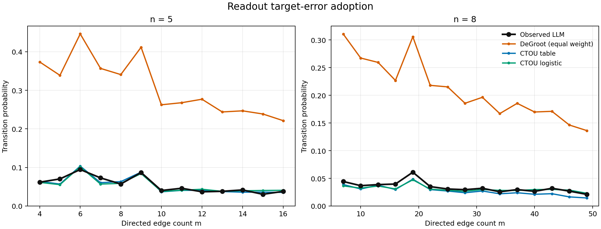
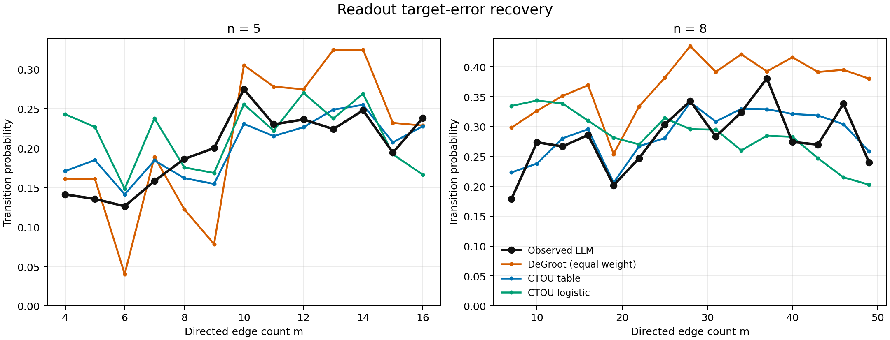

# CTQO/CTOU 状态转移预测对比（Llama-3.1-8B dense-50 pilot）

## 1. 目的

检验节点的下一轮状态是否可由一个不读取文本、任务身份和图结构的局部状态模型预测，并与经典等权 DeGroot 更新作直接对比。

本文沿用现有数据管线中的四状态记号：

- `C`：correct；
- `T`：预先冻结的 target error；
- `O`：其他可解析错误；
- `U`：无法解析。

用户讨论中的 CTQO 在当前实现中写作 CTOU，以免把 `U`（unparsed）误写成其他状态。

## 2. 输入与验证协议

每次正常 receiver 更新只使用：

```text
previous_state, round, #C, #T, #O, #U
```

明确排除：消息文本、task ID、graph ID、图结构、`n`、`m`、density 和 receiver 类型。

预测采用 5 个 graph folds × 5 个 task folds 的 crossed holdout。每个测试单元中的 graph 和 task 均未出现在该单元训练集中；25 个单元的 graph/task overlap 都为 0。所有 394,800 个配对节点更新各被预测一次。

对比四种模型：

1. **Persistence**：节点保持上一状态；
2. **DeGroot equal-weight**：自身上一状态和所有入站消息等权平均；
3. **CTOU table**：按上一状态、轮次和精确入站组成估计离散转移表，使用层级平滑；
4. **CTOU logistic**：使用同一组变量拟合多项 logistic transition model。

主要评估 readout，因为最终系统答案由 readout 决定。置信区间按 task bootstrap 10,000 次计算，条件于当前采样的 graphs、模型和运行配置。

## 3. Readout 下一状态预测

| 模型 | Brier ↓ | Log loss ↓ | 分类错误率 ↓ |
|---|---:|---:|---:|
| Persistence | 0.2586 | 1.7861 | 0.1293 |
| DeGroot | 0.2222 | 0.7414 | 0.1091 |
| CTOU table | 0.1622 | 0.3351 | 0.1021 |
| CTOU logistic | **0.1606** | **0.3339** | **0.1011** |

相对 DeGroot，CTOU logistic 的 Brier score 降低 27.7%，log loss 降低 55.0%。按任务配对 bootstrap，Brier 差为 −0.0616，95% CI [−0.0683, −0.0545]。

## 4. Readout target-error adoption

评估集合限定为：上一状态为 `C`，且当前轮收到至少一个 `T`。正例是攻击条件变为 `T`，同时配对 clean 更新没有变为 `T`。

共有 53,245 个 eligible updates，真实 adoption rate 为 3.80%。

| 模型 | 平均预测率 | Brier ↓ | Log loss ↓ | AP ↑ | ROC-AUC ↑ |
|---|---:|---:|---:|---:|---:|
| Persistence | 0.00% | 0.0436 | 0.6019 | 0.0380 | 0.5000 |
| DeGroot | 23.01% | 0.0780 | 0.3071 | 0.1504 | 0.7284 |
| CTOU table | 3.33% | 0.0391 | 0.1588 | 0.1543 | 0.7724 |
| CTOU logistic | **3.63%** | **0.0391** | **0.1587** | **0.1926** | **0.7758** |

CTOU logistic 相对 DeGroot 的 adoption Brier 降低 49.9%；配对差为 −0.0389，95% CI [−0.0432, −0.0339]。

DeGroot 的重要表现是：它对不同 `m` 下 adoption 曲线的排序并不差，但绝对概率严重失准。

| 模型 | n=5 curve MAE ↓ | n=5 Spearman ↑ | n=8 curve MAE ↓ | n=8 Spearman ↑ |
|---|---:|---:|---:|---:|
| DeGroot | 0.2547 | 0.8736 | 0.1768 | 0.9393 |
| CTOU table | 0.0055 | 0.8132 | 0.0064 | **0.9536** |
| CTOU logistic | 0.0056 | 0.7692 | **0.0042** | 0.9036 |

因此，入站 target proportion 可以解释曲线方向的一部分，但“按比例线性采纳”并不能描述 LLM readout 的实际反应强度。当前 LLM 节点表现出强得多的状态惯性或选择性拒绝。



## 5. Readout target-error recovery

评估集合限定为上一状态为 `T`。正例是当前状态不再为 `T`。

共有 2,902 个 updates，真实 recovery rate 为 24.53%。

| 模型 | 平均预测率 | Brier ↓ | Log loss ↓ | AP ↑ | ROC-AUC ↑ |
|---|---:|---:|---:|---:|---:|
| Persistence | 0.00% | 0.3159 | 4.3636 | 0.2453 | 0.5000 |
| DeGroot | 29.91% | 0.2052 | 1.1111 | 0.4582 | **0.7502** |
| CTOU table | **25.00%** | **0.1967** | **0.5788** | **0.4651** | 0.7429 |
| CTOU logistic | 25.67% | 0.1969 | 0.5847 | 0.4517 | 0.7457 |

CTOU 对 recovery 的 log loss 明显低于 DeGroot，但 Brier 改善只有约 4%。按任务配对 bootstrap，CTOU table 与 DeGroot 的 Brier 差为 −0.0085，95% CI [−0.0245, 0.0054]，不能据此确认总体 Brier 改善。

按 `m` 重建 recovery 曲线时，精确 table 优于线性 logistic：

- CTOU table：n=5 MAE 0.0241、Spearman 0.8022；n=8 MAE 0.0255、Spearman 0.8071；
- CTOU logistic：n=5 MAE 0.0389、Spearman 0.3956；n=8 MAE 0.0563、Spearman −0.0214。

这表明 recovery 对精确状态组合的关系可能比 adoption 更非线性；但 readout recovery 只有 2,902 个 eligible updates，当前证据不支持进一步机制性断言。



## 6. 当前可以做出的 claim

1. **可以确认**：在未见过的 graph 和 task 上，仅使用上一状态、轮次和 C/T/O/U 入站组成，能够很好地重建 readout adoption 的密度曲线，并显著优于等权 DeGroot 的概率预测。
2. **可以确认**：DeGroot 对 adoption 曲线排序有信息，但系统性高估绝对采纳率；经典 exposure/mixing 解释了方向的一部分，却没有解释 LLM 的更新尺度。
3. **可以确认**：简单 CTOU logistic 已足以预测 adoption；recovery 更适合精确 table，可能存在更强非线性。
4. **不能声称**：这些结果证明 LLM 实现了 CTOU 转移律。输入组成是运行后实现的 post-treatment variable。
5. **不能声称**：剩余误差就是语言语义效应。当前模型没有输入文本；要识别文本语义的额外贡献，需要在相同 C/T/O/U 组成内加入消息内容特征或做语义保持的反事实改写。
6. **不能声称**：当前结论跨模型、数据集成立。结果来自一个 Llama-3.1-8B、GSM8K、50-task pilot。

## 7. 下一步最小验证

当前优先级不是立刻增加更复杂预测器，而是：

1. 做 leave-`m`-out 敏感性分析，检查 CTOU 是否能外推到训练中完全未见过的密度；
2. 在同一精确 C/T/O/U composition 内比较不同消息语义，量化文本是否提供显著增量预测；
3. 在另一个模型或更难数据集上复现，以区分 LLM-family effect 与普遍状态动力学。
