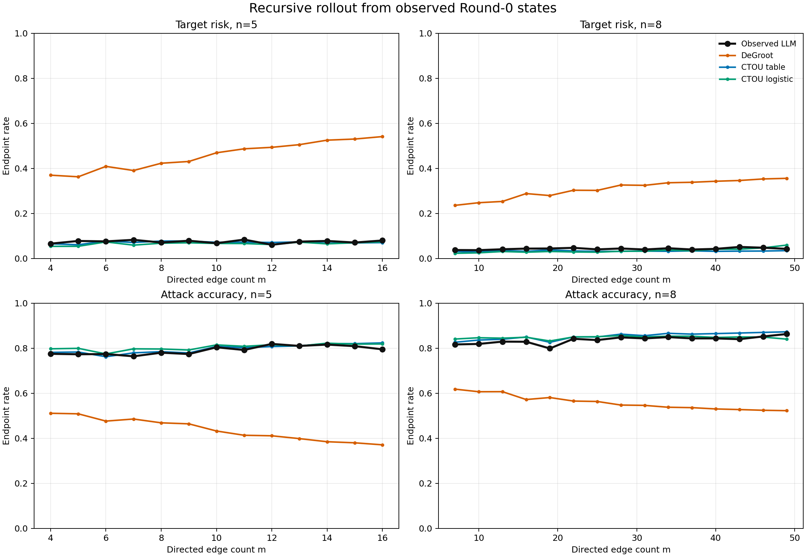
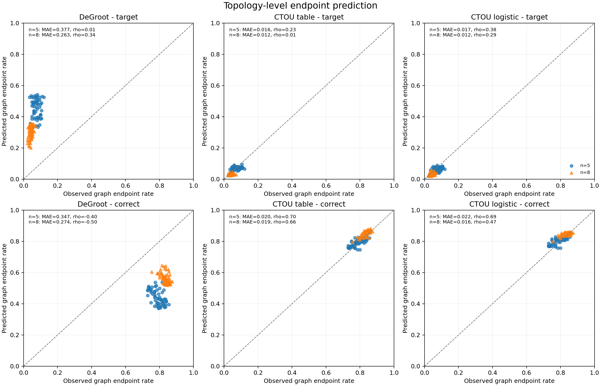
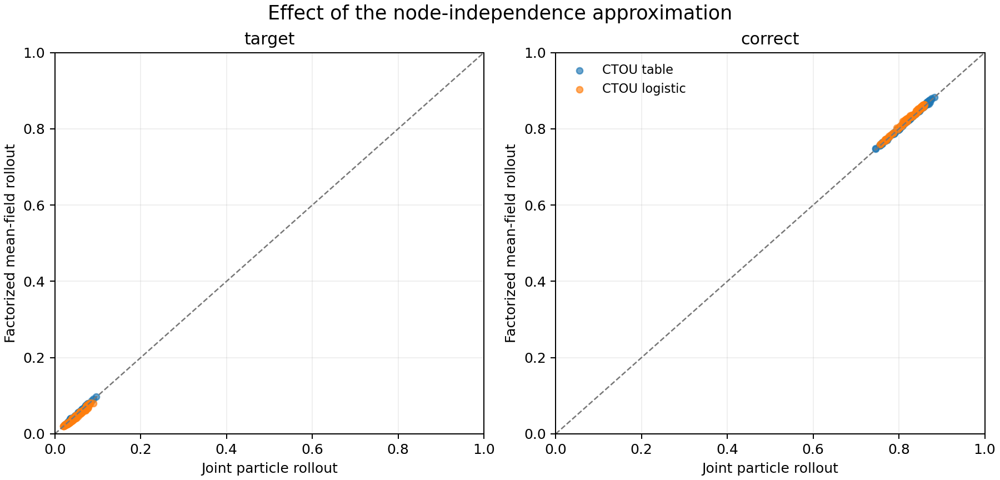

# CTOU recursive rollout 结果（Llama-3.1-8B dense-50 pilot）

## 1. 结论摘要

本实验完成了从局部一步预测到系统 endpoint 预测的关键升级：模型只读取真实 Round 0 的节点状态、通信图、攻击节点和调度规则，Round 1 之后不再读取任何真实 LLM 状态、消息 composition 或文本，而是递归生成后续状态直到 readout。

在当前 50 题、132 张图、37,050 个攻击 endpoint 上，CTOU table 和 CTOU logistic 均显著优于等权 DeGroot，并能较准确地恢复 attack accuracy 的密度响应曲线和 graph-level 排序。这说明，至少在当前 Llama/GSM8K pilot 中，基于 `previous state + round + incoming C/T/O/U composition` 的内容无关局部转移律，已经包含了预测聚合鲁棒性的主要信息。

但它还不是完整的 topology evaluator：输入仍包含真实 Round-0 状态；对稀有 target-error endpoint 的逐图排序能力较弱；结果也只来自一个模型、一个数据集和一个通信协议。

## 2. 数据完整性修正

递归实验前的审计发现，旧分析使用表面数值字符串分类状态，会把数值等价表达拆成不同类别。例如目标答案是 `2.2` 时，节点输出 `11/5` 会被误标为 `O`，尽管执行时 Oracle 已正确写入 `answer_state=target_error`。

本轮统一优先采用 trace/message 中执行时 Oracle 的 `answer_state`：

- `correct -> C`
- `target_error -> T`
- `other_error -> O`
- `unparsed -> U`

只有旧 trace 缺少该字段时才回退到表面解析。该问题影响旧分析中的 4/50 个任务和 2,964/37,050 个攻击 endpoint，因此旧 CTOU v1 数值已标记为 superseded，本报告及 corrected one-step v2 均使用修正后的状态。

## 3. 实验边界

每个 held-out case 允许 evaluator 使用：

- 有向图和 readout；
- attack-node identity；
- 全部节点真实 Round-0 C/T/O/U 状态；
- horizon 和同步 active-node schedule。

禁止使用：

- Round 1 及之后的真实节点状态；
- Round 1 及之后的真实 incoming composition；
- 任意后续答案、推理文本或 task identity。

采用 5 graph folds x 5 task folds 的 crossed holdout。测试单元 `(g,t)` 的训练数据同时排除 graph fold `g` 和 task fold `t`，因此每个测试 endpoint 对 transition model 来说都属于 unseen graph 和 unseen task。

完整性统计：

| 项目 | 数量 |
|---|---:|
| 节点转移 updates | 394,800 |
| 攻击 endpoint cases | 37,050 |
| tasks | 50 |
| graphs | 132 |
| strata | 28 |
| 唯一 Round-0 evaluator 输入 | 18,522 |
| crossed holdout cells | 25/25 |

## 4. 对比模型

1. **Persistence**：正常节点保持上一轮状态，攻击节点固定为 `T`。
2. **Equal-weight DeGroot**：receiver 自身上一轮状态和所有 incoming 邻居状态具有相同权重。
3. **CTOU table**：按 `previous state + round + exact C/T/O/U counts` 查询平滑转移表。
4. **CTOU logistic**：使用 previous-state、round、incoming counts 和 fractions 的多项 logistic model。

CTOU 不使用文本、task/graph identity、图特征、`n`、`m`、density 或 receiver 是否为 readout。

主分析使用 2,048-particle joint rollout；敏感性分析使用 factorized mean-field rollout。

## 5. Endpoint 概率预测

真实 endpoint 的总体 target-error rate 为 **5.34%**，attack accuracy 为 **82.07%**。

| Particle rollout | Predicted target rate | Predicted correct rate | 4-state Brier | Target Brier | Correct Brier |
|---|---:|---:|---:|---:|---:|
| Persistence | 0.19% | 80.58% | 0.386 | 0.0547 | 0.1671 |
| DeGroot | 35.40% | 52.24% | 0.440 | 0.1602 | 0.2012 |
| CTOU table | 4.56% | 83.34% | **0.212** | **0.0501** | **0.0920** |
| CTOU logistic | 4.40% | 83.34% | 0.213 | 0.0506 | 0.0925 |

相对 DeGroot，CTOU table 的 task-paired loss difference 为：

| Metric | Difference | Task-bootstrap 95% CI |
|---|---:|---:|
| 4-state Brier | -0.227 | [-0.255, -0.196] |
| Target Brier | -0.110 | [-0.123, -0.096] |
| Correct Brier | -0.109 | [-0.126, -0.090] |
| 4-state log loss | -0.599 | [-0.741, -0.494] |

CTOU table 也显著优于 persistence：4-state Brier difference 为 `-0.174`，95% CI `[-0.227,-0.124]`；target Brier difference 虽小，但仍为 `-0.0046`，95% CI `[-0.0077,-0.0018]`。

## 6. 密度响应曲线

对 attack accuracy，CTOU table 的 fixed-`n` 曲线结果为：

| n | m levels | Curve MAE | Spearman rho |
|---:|---:|---:|---:|
| 5 | 13 | 0.0095 | 0.795 |
| 8 | 15 | 0.0164 | 0.903 |

DeGroot 在同一指标上的 MAE 分别为 0.352 和 0.278，Spearman 分别为 -0.781 和 -0.835。它预测增加边会持续提高 target mass、降低 attack accuracy；当前真实 LLM pilot 的 attack accuracy 总体上随 `m` 上升，方向相反。

这个结果只说明**等权、内容无关的线性混合不是当前 LLM 更新过程的合适近似**。它不说明任何经典图论定理错误，也不能仅凭方向差异断言存在特定语义机制。

对 target-error rate，真实曲线整体较平且低基率。CTOU 的 curve MAE 仍低，但排序相关较弱：table 在 `n=5/8` 上的 rho 分别为 0.096 和 0.344。因此不能用当前结果声称 CTOU 已稳定恢复 target-risk 的细微密度变化。

## 7. Graph-level topology ranking

对 attack accuracy，CTOU table 的 graph-level 结果为：

| n | Graphs | MAE (95% graph-bootstrap CI) | Spearman rho (95% CI) |
|---:|---:|---:|---:|
| 5 | 61 | 0.0198 [0.0167, 0.0230] | 0.703 [0.548, 0.811] |
| 8 | 71 | 0.0191 [0.0167, 0.0216] | 0.664 [0.488, 0.795] |

这支持 CTOU 作为当前设置下的 **aggregate robustness topology evaluator**：它不仅预测平均 endpoint，也能在 unseen graph/unseen task 上恢复相当一部分图排序。

但 target-error graph ranking 明显更弱：

| Model | n | MAE | Spearman rho (95% CI) |
|---|---:|---:|---:|
| CTOU table | 5 | 0.0158 | 0.235 [-0.033, 0.482] |
| CTOU table | 8 | 0.0117 | 0.014 [-0.232, 0.254] |
| CTOU logistic | 5 | 0.0168 | 0.375 [0.133, 0.585] |
| CTOU logistic | 8 | 0.0119 | 0.291 [0.050, 0.509] |

其中 `n=8` 的真实逐图 target rate 标准差仅为 0.0094，低基率和窄变化范围使 ranking 更困难。当前证据不足以把 CTOU 称为可靠的 target-risk graph ranker。

## 8. Joint particle 与 mean-field

在 132 张图上，CTOU table 的 particle/mean-field graph prediction 绝对差异为：

- target：mean 0.0010，95th percentile 0.0025，max 0.0049；
- correct：mean 0.0017，95th percentile 0.0041，max 0.0051。

因此，在当前 endpoint 聚合尺度和最多 8 个节点的设置下，显式维护共享祖先造成的联合状态相关性没有明显改善预测。这个结果不表示节点状态真实独立，只表示 factorized approximation 对当前图级输出已经足够接近 particle rollout。

## 9. Corrected one-step v2 与递归误差

修正状态 Oracle 后，一步 next-state 预测仍支持 CTOU 优于 DeGroot：

| One-step metric | DeGroot | CTOU table |
|---|---:|---:|
| Next-state 4-state Brier | 0.248 | 0.185 |
| Adoption mean prediction | 23.20% | 4.17% |
| Adoption observed rate | 4.50% | 4.50% |
| Readout adoption mean prediction | 23.01% | 3.36% |
| Readout adoption observed rate | 3.80% | 3.80% |

递归 endpoint 的 4-state Brier 从 one-step 的 0.185 上升到 0.212，表明存在 compounding error，但没有破坏 aggregate attack-accuracy 曲线和 graph ranking。

## 10. 当前能够支持的 claim

可以支持：

> 在当前同质 Llama/GSM8K MAS pilot 中，等权 DeGroot 严重高估 target-error 扩散并错误预测密度趋势。一个不读取文本、仅学习 C/T/O/U 局部转移的模型，从真实 Round 0 递归 rollout 后，可以较准确地预测 aggregate attack accuracy 及其 topology ranking。

暂不能支持：

- CTOU 可以只从 topology 预测 utility/robustness；Round-0 状态仍是真实观测输入。
- CTOU 已能可靠排序逐图 target-error risk。
- 差异必然由自然语言语义造成；当前 coarse composition 已解释大部分 aggregate endpoint。
- 结论可迁移到其他模型、MATH、代码任务、更大图或其他通信协议。
- 经典图论结论被推翻；被拒绝的是当前等权 DeGroot 更新假设在该实验中的适用性。

## 11. 下一步

下一步应优先做 protocol 中原本排在后面的 leave-`m`-out / density extrapolation：训练 transition law 时完全排除若干 `m` levels，再递归预测这些未见密度的 endpoint 曲线。这能区分 CTOU 是学到了可迁移的局部动力学，还是主要在训练密度范围内插值。

之后再做同一 C/T/O/U composition 下的文本语义对照。当前递归结果表明 coarse state composition 已经足以解释 aggregate robustness；语义实验应聚焦 CTOU 残差最大的 case，而不是无差别增加文本特征。
