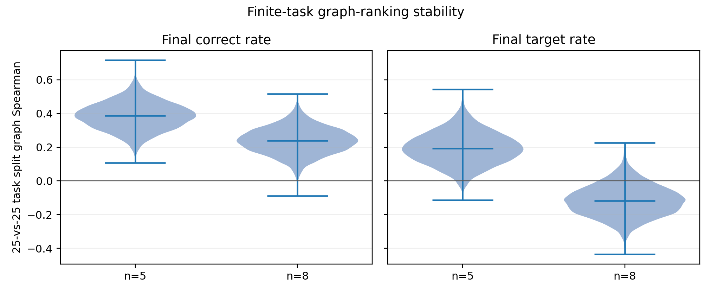
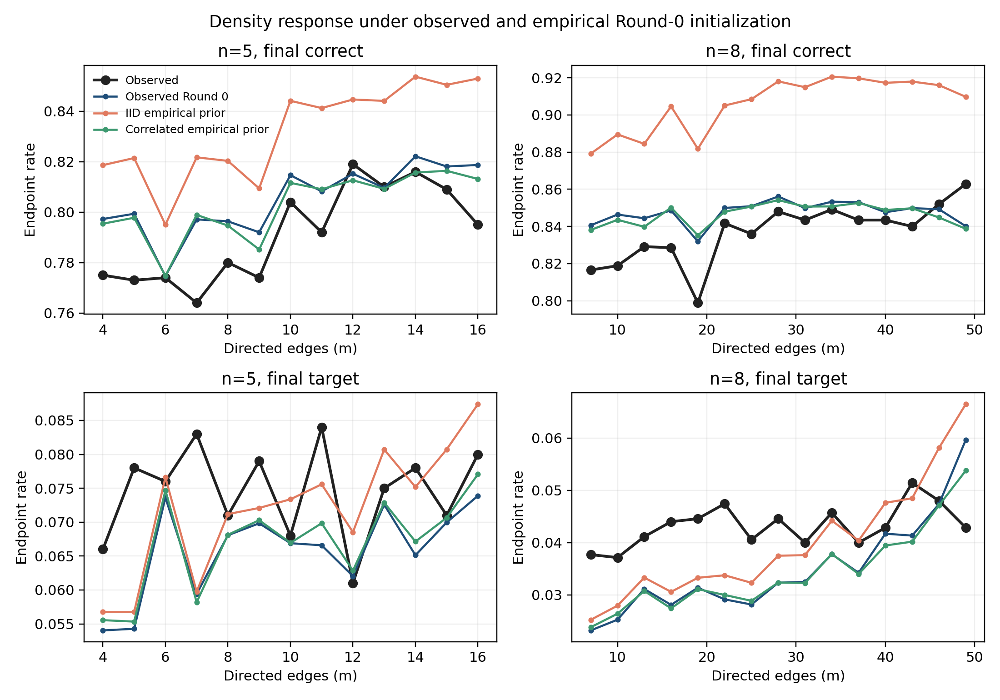
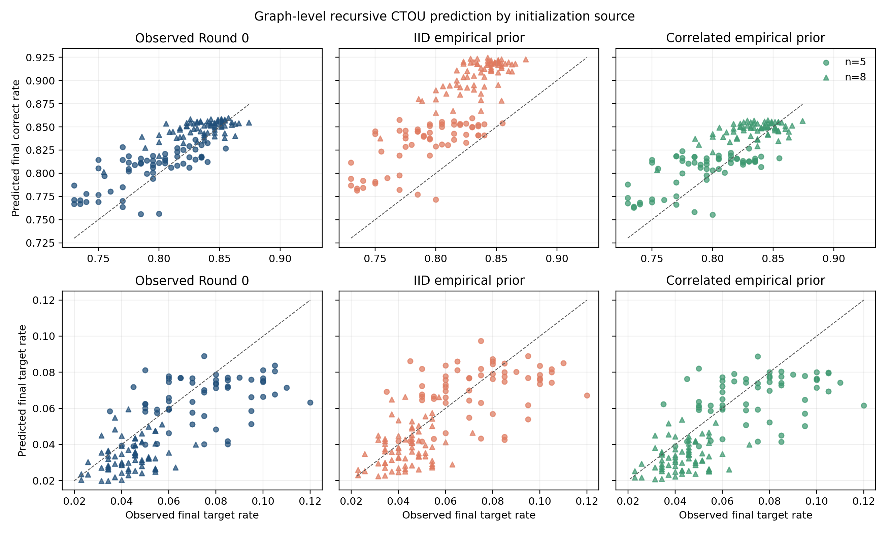
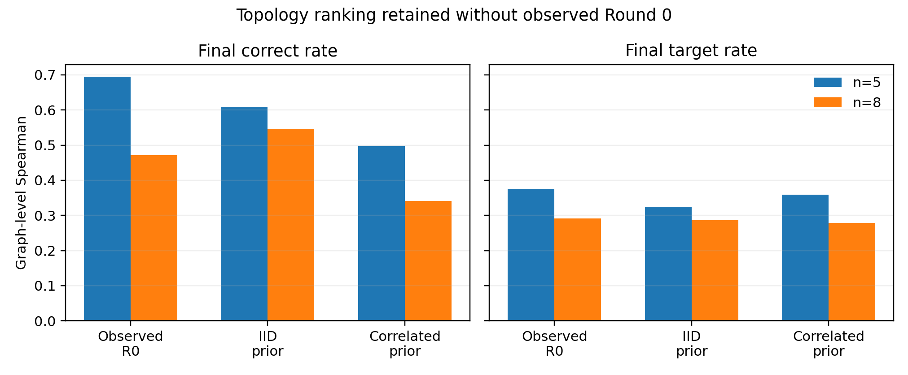

# CTOU Round-0-free 实验结果

## 1. 核心结论

本轮先估计 50 题下真实 graph ranking 的有限样本稳定性，再将 CTOU 从观察真实 Round-0 状态改为只使用训练数据中的 model/task-distribution prior。

结论必须区分三种能力：

> **分布级校准：保留题目级相关性的 empirical prior 几乎恢复了 oracle Round-0 的 graph/density calibration。细粒度图排序：去掉真实 Round 0 后仍保留部分 topology signal，但 correct ranking 有所下降。单题 endpoint 预测：明显下降，因为 empirical prior 故意不读取测试题。**

因此，当前结果支持把 CTOU 推进到：

\[
G+\mathcal D(S_0\mid\text{Llama, GSM8K})\rightarrow\widehat R(G),
\]

但不支持声称已经得到不依赖 model/task distribution 的：

\[
G\rightarrow\widehat R(G).
\]

## 2. 实验设计

数据仍是 Llama-3.1-8B、GSM8K 50 题 dense pilot：

- 132 张图；
- 37,050 个真实 attack endpoints；
- 394,800 条正常节点 transition；
- 25 个严格的 graph-fold × task-fold 测试单元；
- 每个经验 prior 采用 2,048 个 joint particles；
- 没有新增 LLM 调用或 GPU 计算。

三种初始化如下：

1. **Oracle**：使用测试 trace 的真实 Round-0 四状态向量；
2. **IID empirical**：仅从训练 folds 估计 benign node 的边际 \(P(C,T,O,U)\)，测试节点独立采样；
3. **Correlated empirical**：从训练 folds 整体抽取一条 benign Round-0 向量，再随机置换到测试图的正常节点。

三种条件共享相同的 CTOU logistic transition、持续目标错误攻击、图、schedule、\(T\) 和 endpoint 定义。攻击节点始终固定为 `T`。每个测试单元的训练/测试 graph ID 和 task ID 重叠均为零。

## 3. Graph-ranking 的有限任务稳定性

将 50 题随机拆成两个互不重叠的 25 题子集，重复 10,000 次；每半分别计算真实 graph endpoint rate，再比较图排序。

| n | Outcome | Median split-half Spearman | 95% interval |
|---:|---|---:|---:|
| 5 | Correct | 0.386 | [0.226, 0.545] |
| 8 | Correct | 0.239 | [0.084, 0.393] |
| 5 | Target | 0.192 | [0.016, 0.385] |
| 8 | Target | -0.118 | [-0.285, 0.067] |

`n=8` target-risk ranking 在两个 25 题半样本间没有可复现方向。因而 CTOU 的低 target graph Spearman 不能单独解释为 transition model 失败。

这里的 split-half 结果只是**经验稳定性参考**，不是数学上严格的 predictor ceiling。CTOU 使用全部训练数据学习平滑动力学，预测相对于 50 题完整聚合值的相关可以高于 25-vs-25 split-half correlation；这不构成矛盾。

## 4. IID Round-0 prior 不足

### 4.1 Aggregate calibration

| Initialization | n | Observed correct | Predicted correct | Bias |
|---|---:|---:|---:|---:|
| Oracle | 5 | 0.7909 | 0.8040 | +0.0131 |
| IID empirical | 5 | 0.7909 | 0.8308 | +0.0399 |
| Correlated empirical | 5 | 0.7909 | 0.8020 | +0.0111 |
| Oracle | 8 | 0.8353 | 0.8479 | +0.0126 |
| IID empirical | 8 | 0.8353 | 0.9056 | +0.0703 |
| Correlated empirical | 8 | 0.8353 | 0.8468 | +0.0115 |

IID prior 对 attack-condition correct rate 明显偏乐观，特别是 `n=8`。correlated prior 将总体偏差恢复到约 1.1 个百分点，与 oracle initialization 基本相同。

### 4.2 为什么 IID 会失败

真实 trace 中，每条 benign Round-0 向量的正确节点数方差为：

| n | Marginal P(C) | Observed variance | IID binomial variance | Dispersion ratio |
|---:|---:|---:|---:|---:|
| 5 | 0.8069 | 1.5500 | 0.6232 | 2.49 |
| 8 | 0.8071 | 4.3122 | 1.0899 | 3.96 |

同一道题的节点并非从一个固定难度的全局边际独立生成。困难题会让多个节点共同更容易出错，导致正确节点数显著过度离散。IID prior 抹掉这种 task-level heterogeneity；在非线性 CTOU rollout 中，仅匹配边际均值不能保证匹配 endpoint 均值。

correlated bootstrap 恢复的是训练分布中的完整状态组成，不是训练图的节点位置：抽取后会随机置换到测试 benign nodes。因此其改进不能由复用某个训练 topology 的位置解释。

## 5. Graph-level calibration 与 ranking

### 5.1 Correct endpoint

| Initialization | n | Graph MAE | Graph Spearman | 95% CI |
|---|---:|---:|---:|---:|
| Oracle | 5 | 0.0218 | 0.695 | [0.519, 0.815] |
| IID empirical | 5 | 0.0411 | 0.609 | [0.409, 0.751] |
| Correlated empirical | 5 | 0.0227 | 0.496 | [0.262, 0.674] |
| Oracle | 8 | 0.0159 | 0.472 | [0.255, 0.653] |
| IID empirical | 8 | 0.0703 | 0.547 | [0.341, 0.711] |
| Correlated empirical | 8 | 0.0162 | 0.341 | [0.099, 0.551] |

correlated prior 的 graph MAE 几乎与 oracle 相同，但图排序相关下降。这说明**恢复 topology response 的绝对水平**与**识别同一分布中最好的具体图**是两个不同目标。

IID prior 的 rank correlation 并不差，但它主要得到了一条整体向上偏移的 response，不能作为可校准 evaluator 使用。高 Spearman 不能弥补 4–7 个百分点的系统性 correct-rate 高估。

### 5.2 Target endpoint

| Initialization | n | Graph MAE | Graph Spearman |
|---|---:|---:|---:|
| Oracle | 5 | 0.0168 | 0.375 |
| Correlated empirical | 5 | 0.0164 | 0.359 |
| Oracle | 8 | 0.0119 | 0.291 |
| Correlated empirical | 8 | 0.0118 | 0.279 |

target metrics 几乎不因去掉真实 Round 0 而变化。不过结合 split-half 结果，只能说 empirical prior 没有进一步破坏当前可测的 target signal；不能说 target topology ranking 已经可靠。

## 6. 排除“只学会 density curve”

跨全部 `m` 的 graph Spearman 会同时利用密度差异。为进一步检查具体边排列，先在每个 `m` 内分别排序 observation 和 prediction，再合并中心化的 within-`m` ranks。

| Initialization | n | Correct within-m correlation | Target within-m correlation |
|---|---:|---:|---:|
| Oracle | 5 | 0.484 | 0.441 |
| Correlated empirical | 5 | 0.271 | 0.358 |
| Oracle | 8 | 0.319 | 0.262 |
| Correlated empirical | 8 | 0.257 | 0.215 |

correlated prior 在固定边数后仍保留正的 topology-ordering signal，因此其表现不只来自复现 \(m\)-curve。但每个 `m` 通常只有 5 张图，单层 Spearman 很不稳定；这些值只用于排除“完全只有 density signal”，不能声称已经精确排序同密度图。

## 7. 为什么 task-level Brier 仍然变差

经验 prior 的目标是对 model/task distribution 积分，不读取测试题，因此同一 test fold 内同一图和攻击位置的预测对所有测试题相同。它可以校准 graph 的分布平均值，却不能预测哪一道题特别困难。

相对 oracle initialization 的 task-bootstrap 配对差异为：

| Initialization | Metric | Loss difference | 95% CI |
|---|---|---:|---:|
| IID empirical | Multiclass Brier | +0.1059 | [0.0302, 0.2009] |
| IID empirical | Correct Brier | +0.0581 | [0.0186, 0.1084] |
| Correlated empirical | Multiclass Brier | +0.0992 | [0.0326, 0.1815] |
| Correlated empirical | Correct Brier | +0.0543 | [0.0189, 0.1000] |
| Correlated empirical | Target Brier | -0.0003 | [-0.0010, 0.0005] |

所以 Round-0-free 的成功范围是 distribution-level topology evaluation，不是 per-task endpoint prediction。如果将来需要为一个具体新题选择拓扑，就仍需学习：

\[
P(S_0\mid q,\text{model}).
\]

## 8. 当前允许的 claim

### 可以声称

1. 在当前 Llama/GSM8K/攻击协议中，CTOU 不需要观察测试题的真实 Round 0，也能较准确恢复 graph-level correct/target endpoint rate 和 density response；前提是 initialization prior 保留训练分布的 vector-level相关结构。
2. Round-0 的全局四状态边际不是充分初始化描述；IID prior 会系统性高估 correct endpoint。
3. empirical initialization 下仍存在超出 density curve 的 within-`m` topology signal，但比 oracle Round 0 弱。
4. target graph ranking 的有限任务稳定性明显弱于 correct ranking，特别是 `n=8`。
5. exact task-specific Round 0 对单题概率预测和一部分细粒度 graph ordering 仍然有价值。

### 不能声称

1. 已经得到只输入图、与 model/task distribution 无关的通用 evaluator；
2. correlated empirical prior 能迁移到 MATH、代码任务、另一模型或不同攻击语义；
3. task-level correlation 因果性地造成 IID bias；当前证据是受控初始化对照加分布诊断；
4. target-risk topology 已经可以可靠排序；
5. empirical prior 能为具体未见任务提供准确 endpoint probability；
6. 当前 50 题已经足以稳定排序同一 `m` 内的 5 张图。

## 9. 对研究路线的影响

这项实验回答了附件提出的路线判别问题：结果没有从 oracle graph Spearman 直接坍缩到接近零，因此不需要把下一阶段全部转向复杂的 task-conditioned Round-0 predictor。对于**同一 model/task distribution 下的 topology 评估**，correlated empirical prior 已经足以打通前端的第一版。

但它也没有完全消除初始化问题：

- IID prior 不可用；
- per-task endpoint loss 明显增加；
- correct graph ranking 有退化。

因此更合理的下一步是按原计划打通后端：在现有 paired clean traces 上运行 **clean CTOU recursive rollout**，检验同一 evaluator 是否能够同时输出：

\[
(\widehat U(G),\widehat R(G),\mathrm{SupportRisk}(G)).
\]

暂时不进入 unrestricted topology optimization，也不急于增加 `n=10`。如果 clean utility 也能由相同初始化与局部转移框架恢复，才具备研究 utility–robustness frontier 的完整基础。

## 10. 产物

- 协议：`docs/ctou_round_zero_free_protocol.md`
- 分析：`scripts/analyze_ctou_round_zero_free.py`
- 递归 rollout 扩展：`scripts/analyze_ctou_recursive_rollout.py`
- 绘图：`scripts/plot_ctou_round_zero_free.py`
- 测试：`tests/test_ctou_round_zero_free.py`
- 汇总数据：`artifacts/llama31-8b-dense50-ctou-round-zero-free-v1/`
- 图片：`docs/assets/ctou_round_zero_free/`
