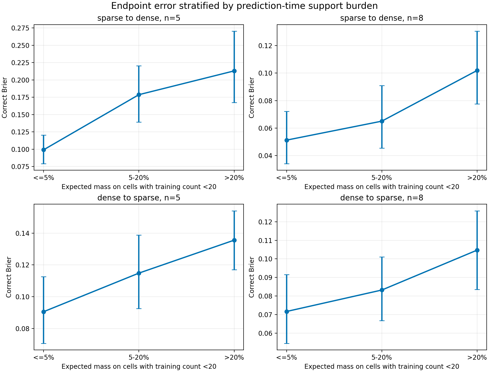
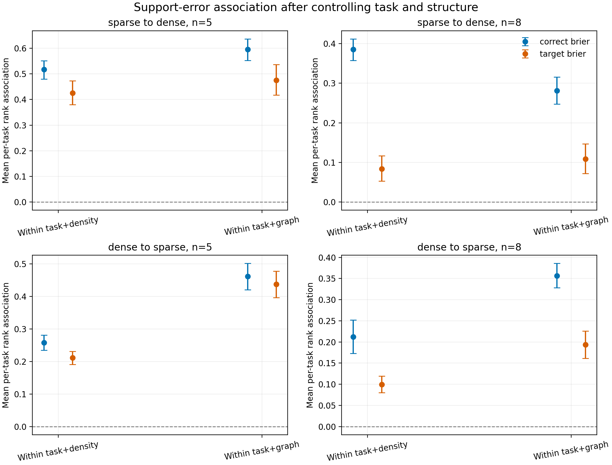
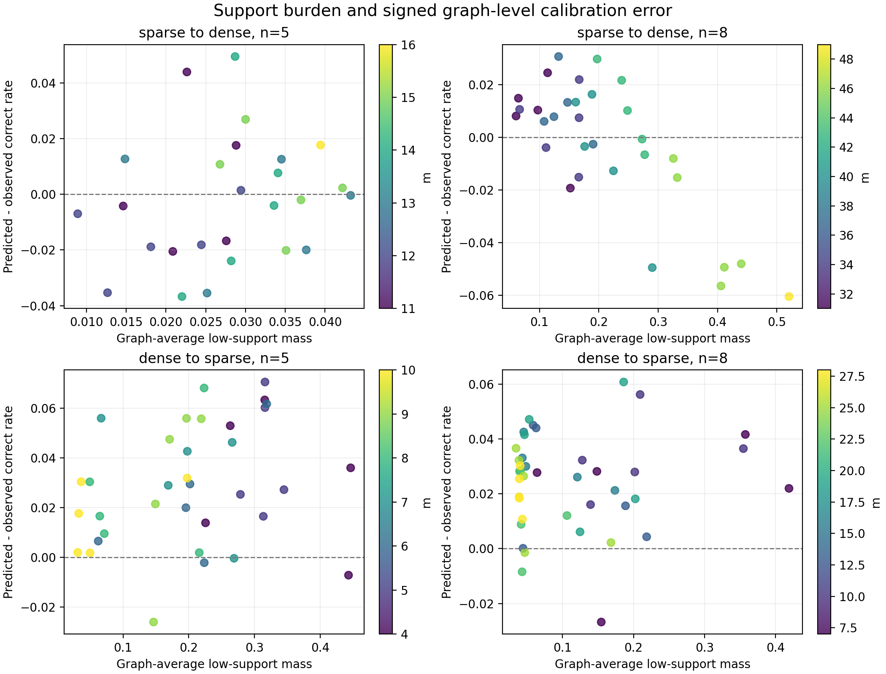

# CTOU support-stratified error 分析

## 1. 核心结论

本轮分析回答了密度外推实验后的第一个问题：CTOU 的外推误差是否与局部 transition table 缺少训练支持有关。

结论需要分成两个层级：

> **Endpoint 层面：低 support 是一个稳定、预测时可计算的误差风险信号。Graph-ranking 层面：support 与图级残差的关系不稳定，因此不能用 support shortage 单独解释 topology ranking 失效。**

在严格 `density+task` 外推中，CTOU 自己递归 rollout 时落入低支持 cell 的概率质量越大，multiclass 和 correct Brier 越高。该关系在控制 task 与 density 后仍然存在；进一步固定同一 task 和 graph、只比较不同 attacker position 时仍然存在。

但是将 endpoint 聚合到 graph 后，在相同 `m` 内，support burden 与 graph residual 的相关方向会随外推方向和 `n` 改变。当前证据只允许声称 support shortage 伴随一部分 endpoint error，不允许声称它已经解释 graph ranking failure，更不构成因果证明。

## 2. 为什么重新定义 support

上一轮只统计了真实测试 trace 中 transition cells 是否在训练集出现。这种指标可以事后解释结果，但需要观察真实 Round 1+ 状态，不能供 topology evaluator 在预测时使用。

本轮同时计算两套 support：

### 2.1 Expected-rollout support

在 CTOU 的 mean-field recursive rollout 中，对每个正常节点更新枚举：

\[
(S_{t-1},t,C,T,O,U)
\]

的概率分布，并累计概率质量落入以下 cells 的程度：

- `count=0`；
- `count<5`；
- `count<10`；
- `count<20`。

该指标只依赖训练 table、真实 Round 0、图、攻击位置和 schedule，不读取真实 Round 1+ trace，是主要的 prediction-time support 指标。

### 2.2 Observed-trace support

对真实 LLM trace 实际经过的 cells 查询相同训练计数。这是 post-hoc 指标，不能包装成部署时可获得的风险估计。

所有 74,100 个 endpoint 的 CTOU 概率均与上一轮保存结果逐一比较，最大允许差异为 `1e-6`。分析通过该一致性检查，没有改变原 CTOU 模型。

## 3. 分层结果

Primary reporting threshold 为 `count<20`，但同时保留 5、10 和连续指标。因为 mean-field 会给多个可能 cell 分配少量概率，所有 endpoint 都有大于零的低支持概率质量，所以分层从 `<=5%` 开始，而不是使用空的“严格零概率质量”组。

### 3.1 Correct Brier

| 外推方向 | n | 低支持质量 <=5% | 5–20% | >20% |
|---|---:|---:|---:|---:|
| Sparse → dense | 5 | 0.0990 | 0.1786 | 0.2130 |
| Sparse → dense | 8 | 0.0512 | 0.0650 | 0.1019 |
| Dense → sparse | 5 | 0.0905 | 0.1148 | 0.1356 |
| Dense → sparse | 8 | 0.0716 | 0.0832 | 0.1047 |

四个设置均呈单调上升。最高低支持组相对最低组的 correct Brier 增幅为：

- Sparse → dense, `n=5`：+0.1140；
- Sparse → dense, `n=8`：+0.0507；
- Dense → sparse, `n=5`：+0.0450；
- Dense → sparse, `n=8`：+0.0331。

误差条使用 task bootstrap，而不是把数万个 endpoint 当成独立样本。

## 4. 控制 task 和结构后的关系

原始 endpoint Spearman 可能被 task difficulty 或 `m` 混杂，因此进一步计算组内 rank association：

1. `within task+density`：先在每个 task、每个 `m` 内排序并中心化，再合并；
2. `within task+graph`：固定同一道题和同一张图，只利用 attacker position 之间的变化。

每个 task 独立计算相关，再对 50 个 task 汇总并 bootstrap。

### 4.1 Correct Brier

| 方向 | n | 控制 task+density | 95% CI | 控制 task+graph | 95% CI |
|---|---:|---:|---:|---:|---:|
| Sparse → dense | 5 | 0.517 | [0.480, 0.551] | 0.596 | [0.552, 0.637] |
| Sparse → dense | 8 | 0.385 | [0.357, 0.412] | 0.281 | [0.247, 0.316] |
| Dense → sparse | 5 | 0.258 | [0.235, 0.281] | 0.462 | [0.420, 0.502] |
| Dense → sparse | 8 | 0.212 | [0.173, 0.252] | 0.356 | [0.328, 0.386] |

50 个 task 的相关方向全部为正。这排除了“关系仅由少数困难 task 或密度端点造成”的简单解释。

### 4.2 Target Brier

Target 关系整体更弱，特别是 Sparse → dense, `n=8`：

| 方向 | n | 控制 task+density | 控制 task+graph |
|---|---:|---:|---:|
| Sparse → dense | 5 | 0.425 | 0.476 |
| Sparse → dense | 8 | 0.084 | 0.109 |
| Dense → sparse | 5 | 0.212 | 0.438 |
| Dense → sparse | 8 | 0.099 | 0.194 |

这与之前 target endpoint 稀少、graph-ranking 信号较弱的观察一致，但还不能区分是低基率噪声还是 CTOU 对 target dynamics 的特定不足；该问题应由下一项 noise-ceiling 分析处理。

## 5. Threshold sensitivity

控制 task+density 后，expected support 与 correct Brier 的 pooled rank association 为：

| 方向 | n | Unseen | count<5 | count<10 | count<20 |
|---|---:|---:|---:|---:|---:|
| Sparse → dense | 5 | 0.422 | 0.382 | 0.454 | 0.517 |
| Sparse → dense | 8 | 0.414 | 0.439 | 0.437 | 0.385 |
| Dense → sparse | 5 | 0.150 | 0.225 | 0.244 | 0.258 |
| Dense → sparse | 8 | 0.129 | 0.220 | 0.254 | 0.212 |

关系不依赖单一的 `<20` 阈值。不同阈值强度并非严格单调，因此 20 不能被解释为真实的统计边界；它只用于可读性分层。

## 6. Expected support 与真实 trace support

两套 support 的 Spearman 为：

| 方向 | n | Low-support fraction | Unseen fraction |
|---|---:|---:|---:|
| Dense → sparse | 5 | 0.901 | 0.979 |
| Dense → sparse | 8 | 0.859 | 0.890 |
| Sparse → dense | 5 | 0.342 | 0.138 |
| Sparse → dense | 8 | 0.799 | 0.722 |

除了 Sparse → dense, `n=5` 这一低 support burden 设置，CTOU rollout 预计的 support 风险与真实 trace 实际遇到的风险大体一致。更重要的是，prediction-time expected support 自身已经能预测误差，不需要事后真实状态才能得到主要关系。

## 7. Graph-level 结果没有给出统一解释

把 endpoint 聚合为 graph 后，首先会看到 support burden 与 `m` 同时变化。控制 `m`、只利用同密度图之间的差异后，expected `<20` support mass 与 absolute correct residual 的条件相关为：

| 方向 | n | Within-density correlation |
|---|---:|---:|
| Sparse → dense | 5 | -0.380 |
| Sparse → dense | 8 | +0.233 |
| Dense → sparse | 5 | +0.214 |
| Dense → sparse | 8 | -0.288 |

符号不一致，而且每个 `m` 通常只有 5 张图。Support burden 因而不能单独解释哪些 topology 会被高估或低估，也不能解释上一轮 sparse→dense 的 graph-ranking collapse。

更精确的表述是：

> 低 transition support 可以标记 CTOU 在哪些 task–graph–attacker endpoint 上更不可靠，但尚不能将这种 endpoint 风险稳定汇总为图级排序误差。

## 8. 当前允许的 claim

### 可以声称

1. 在当前密度外推实验中，预测时可计算的低 support burden 与 endpoint CTOU error 存在稳定、近似单调的关系。
2. 该关系在控制 task、density 和 graph 后仍然存在，不只是跨密度或 task difficulty 的混杂。
3. 关系对 5、10、20 和 unseen 等多种 support 定义总体稳健。
4. Support 对 correct/multiclass error 的解释明显强于部分 target-error 设置。

### 不能声称

1. 低 support 导致了 CTOU error；当前分析仍是观察性的；
2. support shortage 已经解释 graph ranking failure；
3. `<20` 是一个真实的理论阈值；
4. 增加相同 cell 的训练样本一定会消除误差；
5. 结论已经跨模型、任务或攻击协议成立。

## 9. 对下一步的影响

附件列出的第二项是 target/correct graph-ranking noise ceiling。当前结果进一步支持把它放在下一优先级：

- endpoint error 已经找到一个可检测的 support risk；
- graph-level residual 仍没有得到统一解释；
- target Brier 的条件关系明显弱于 correct Brier。

因此下一步应先估计 target 与 correct graph ranking 本身的 split-half reliability，再判断 CTOU 的低 target Spearman 是模型不足，还是可排序信号本身有限。暂时不需要新增 LLM 推理。

## 10. 产物

- 协议：`docs/ctou_support_stratified_error_protocol.md`
- 分析：`scripts/analyze_ctou_support_stratified_error.py`
- 绘图：`scripts/plot_ctou_support_stratified_error.py`
- 测试：`tests/test_ctou_support_stratified_error.py`
- 汇总数据：`artifacts/llama31-8b-dense50-ctou-support-stratified-error-v1/`
- 图片：`docs/assets/ctou_support_stratified/`
